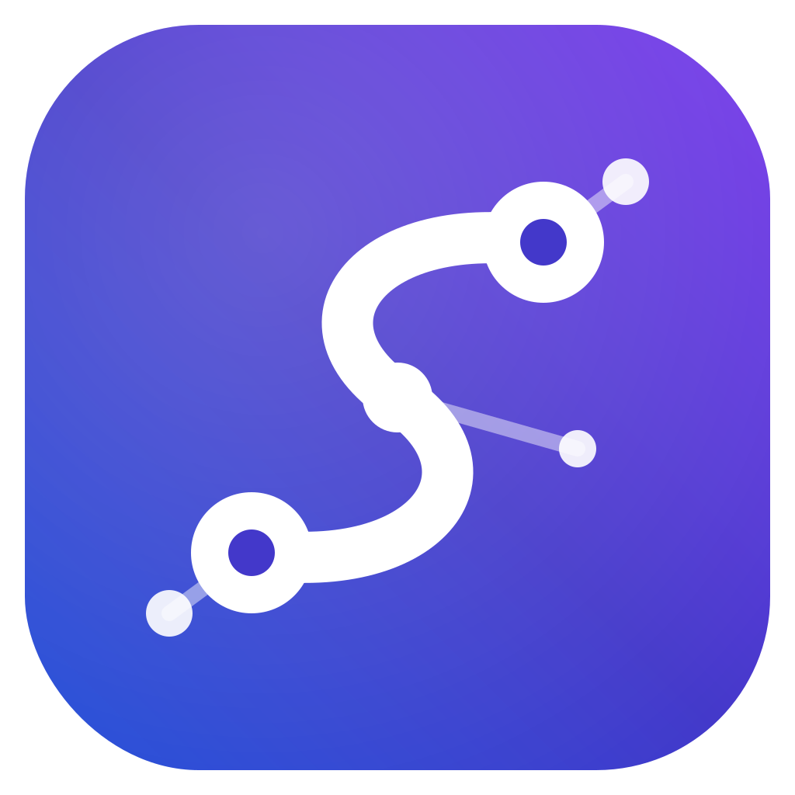
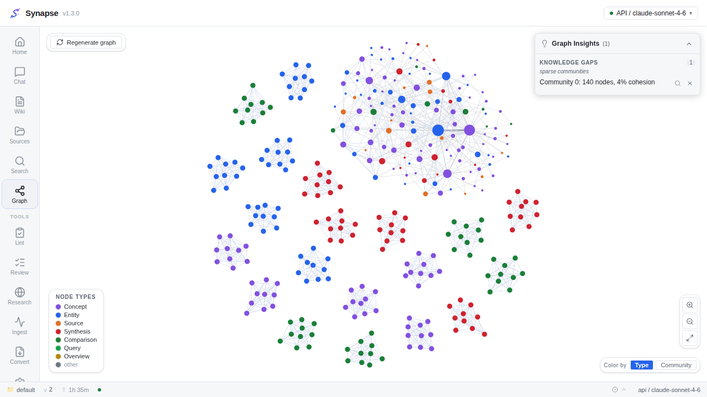
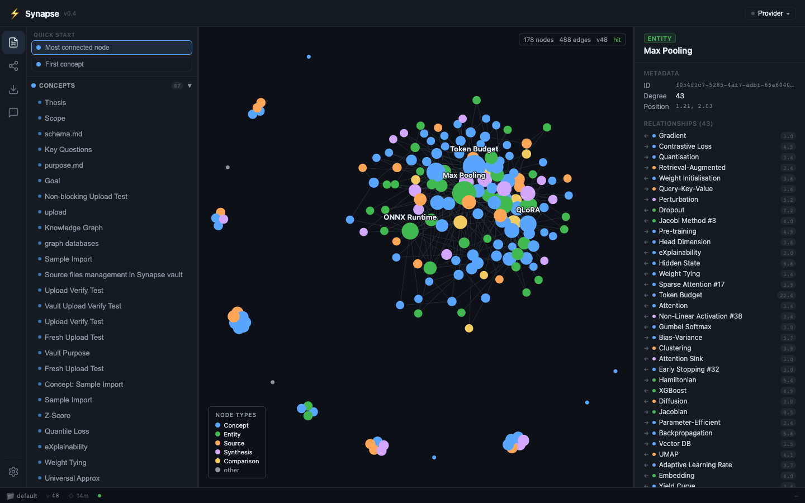
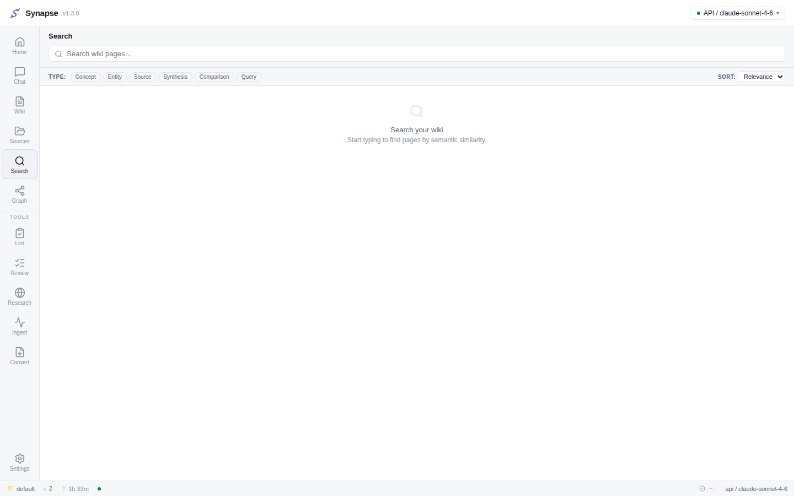
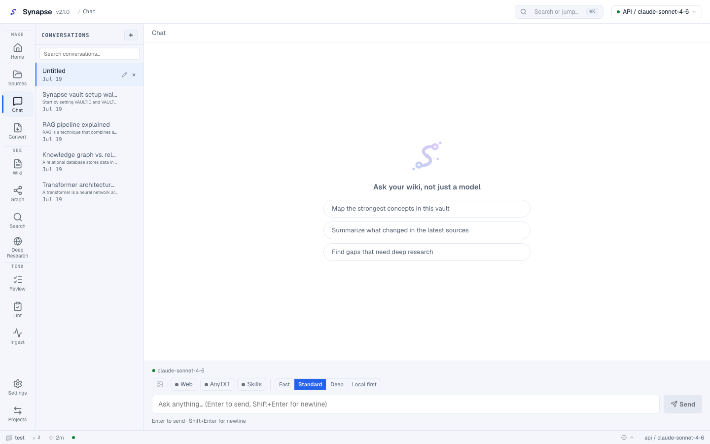
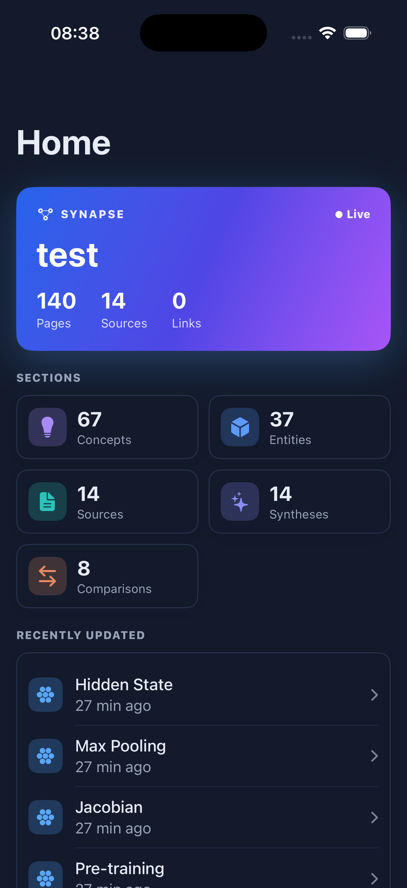
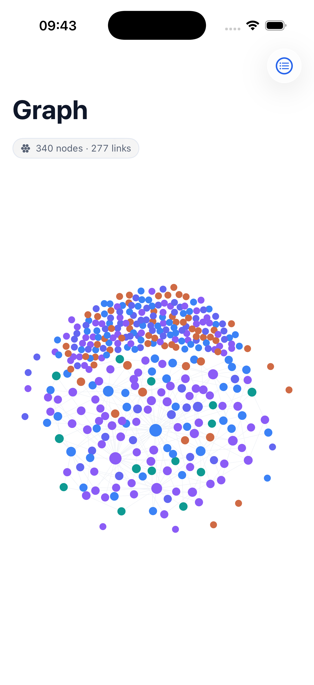

<div align="center">



# Synapse

**The self-hosted LLM wiki that turns your sources into connected knowledge.**
*Connect everything.*

Drop in raw documents — Synapse reads them, writes interlinked wiki pages,
builds a weighted knowledge graph, and lets you chat with your own knowledge base, with citations.

[](https://github.com/Emanuele-Chiummo/llm-wiki-synapse/releases/latest)
[](https://github.com/Emanuele-Chiummo/llm-wiki-synapse/actions/workflows/ci.yml)
[](https://github.com/Emanuele-Chiummo/llm-wiki-synapse/actions/workflows/desktop-release.yml)
[](LICENSE)

*Based on the [LLM Wiki pattern by Andrej Karpathy](https://karpathy.ai/llm_wiki) ([nashsu/llm_wiki](https://github.com/nashsu/llm_wiki)), re-engineered for performance and self-hosting.*

</div>

---

## What it does

| | |
|---|---|
| 📥 **Ingest anything** | Markdown, PDF, DOCX, PPTX, XLSX — via file watcher, upload, scheduled folder import, or the Chrome web clipper. An LLM analyzes each source and writes typed, interlinked wiki pages. |
| 🕸️ **Knowledge graph** | 4-signal edge weighting, server-side ForceAtlas2 layout, Louvain communities, WebGL rendering (sigma.js). Never freezes your browser. |
| 💬 **Chat with citations** | 4-phase retrieval (vector → graph expansion → token budget → assembly) over your wiki, streamed answers with `[n]` citations, save-to-wiki. |
| 🔍 **Deep research** | Bounded agentic loop over SearXNG web search → synthesized, cited pages, auto-ingested. |
| 🧑‍⚖️ **Human in the loop** | Review queue for AI proposals, bounded lint-fix loop with human-gated apply, cascade delete with dry-run. |
| 🔌 **Bring your own AI** | Pluggable inference provider: **Local** (Ollama), **API** (Anthropic / OpenAI-compatible), **CLI** (claude-agent-sdk). Switch per vault or per operation. |
| 📦 **Obsidian-compatible** | The `wiki/` folder is a valid Obsidian vault: YAML frontmatter, `[[wikilinks]]`, auto-generated `.obsidian/`. |
| 🤖 **MCP server** | Nine read/write tools (search, get/write page, graph neighborhood, review queue, ...) exposed over stdio and HTTP — talk to your wiki from Claude Desktop, Claude Code, or any MCP client. |
| 🖥️ **Desktop app** | Native macOS/Windows app (Tauri v2, ~6 MB) with auto-update from GitHub Releases. Point it at your server and go. |
| 📱 **iOS app** | Native SwiftUI client (iOS 17+) — Home, Wiki, Chat, Graph, and review queue against your own server, brand-matched to the desktop UI. |

## Screenshots

| Knowledge graph (dark) | Wiki + graph workspace |
|---|---|
|  |  |

| Search with type filters | Chat |
|---|---|
|  |  |

| iOS — Home | iOS — Graph |
|---|---|
|  |  |

## Quick start (server)

```bash
git clone https://github.com/Emanuele-Chiummo/llm-wiki-synapse.git
cd llm-wiki-synapse
cp .env.example .env        # configure DB, Ollama/Qdrant endpoints, provider
docker compose up -d
```

Open `http://localhost:8000` (API) — serve the frontend with `make dev` or any static host.
Requires: Docker, plus the services you already run — Ollama (inference/embeddings, bge-m3), Qdrant (vectors), optionally SearXNG (web search).

## Desktop app

Download the latest **`.dmg` (macOS)** or **`.exe` (Windows)** from [Releases](https://github.com/Emanuele-Chiummo/llm-wiki-synapse/releases/latest).
First launch: enter your backend URL (local servers are auto-detected). Builds are unsigned for now — macOS: right-click → Open; Windows: "More info" → "Run anyway". The app checks GitHub for updates at startup and offers to install them.

## iOS app

Native SwiftUI client, source in [`ios/`](ios/). Not on the App Store yet: build and run it
yourself with Xcode (free Apple ID, 7-day install), or produce an unsigned `.ipa` with
[`ios/build-unsigned-ipa.sh`](ios/build-unsigned-ipa.sh) to sideload via
[AltStore](https://altstore.io) or [Sideloadly](https://sideloadly.io). TestFlight distribution
is wired up (`ios/scripts/testflight.sh`) but not yet live — it needs a paid Apple Developer
Program enrollment. Full instructions: [`ios/README.md`](ios/README.md).

## Documentation

- [User guide](docs/USER.md) · [Deploy guide](docs/DEPLOY.md) · [Changelog](CHANGELOG.md)
- [Architecture (C4)](docs/architecture/) · [ADRs](docs/adr/) · [API reference](docs/api/)
- [Contributing](CONTRIBUTING.md) · [Security policy](SECURITY.md)

## Stack

FastAPI · SQLAlchemy 2 · PostgreSQL 16 · Qdrant · bge-m3 · FastMCP — React 19 · Vite · CodeMirror 6 · sigma.js · Zustand — Tauri v2 · Swift/SwiftUI.

## License

[MIT](LICENSE) © 2026 Emanuele Chiummo
