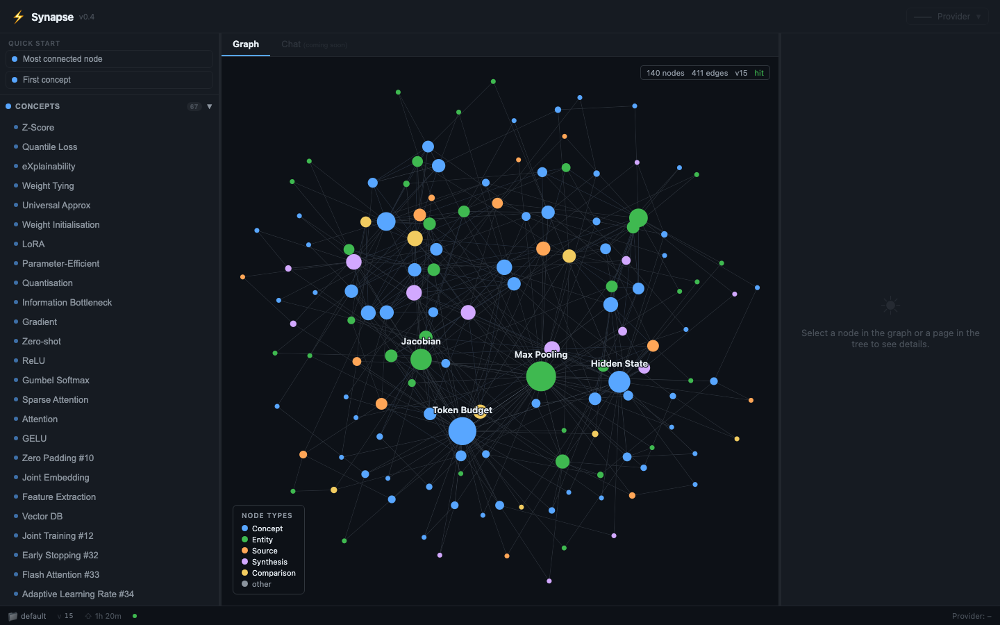
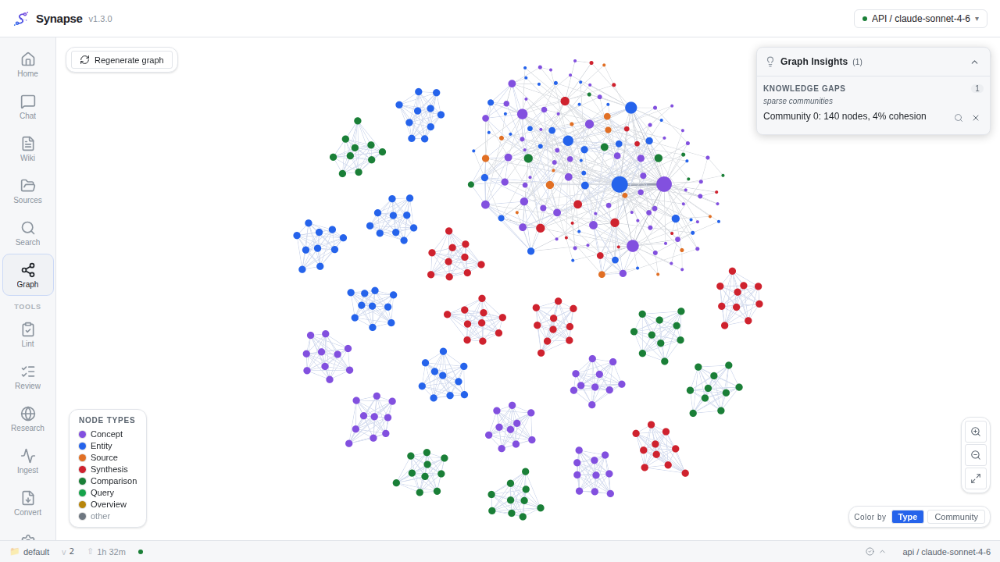
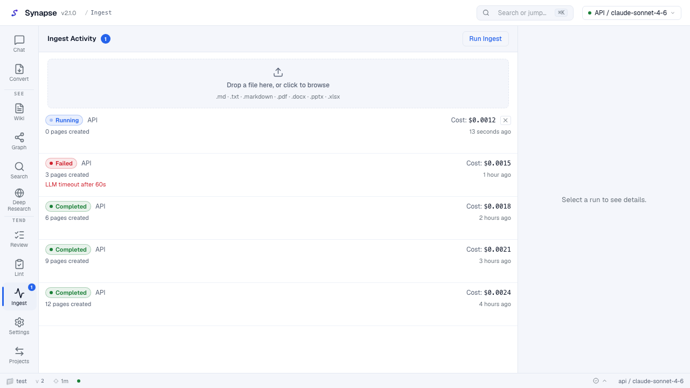
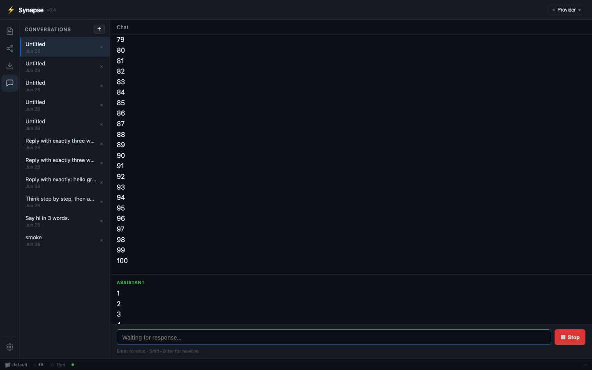
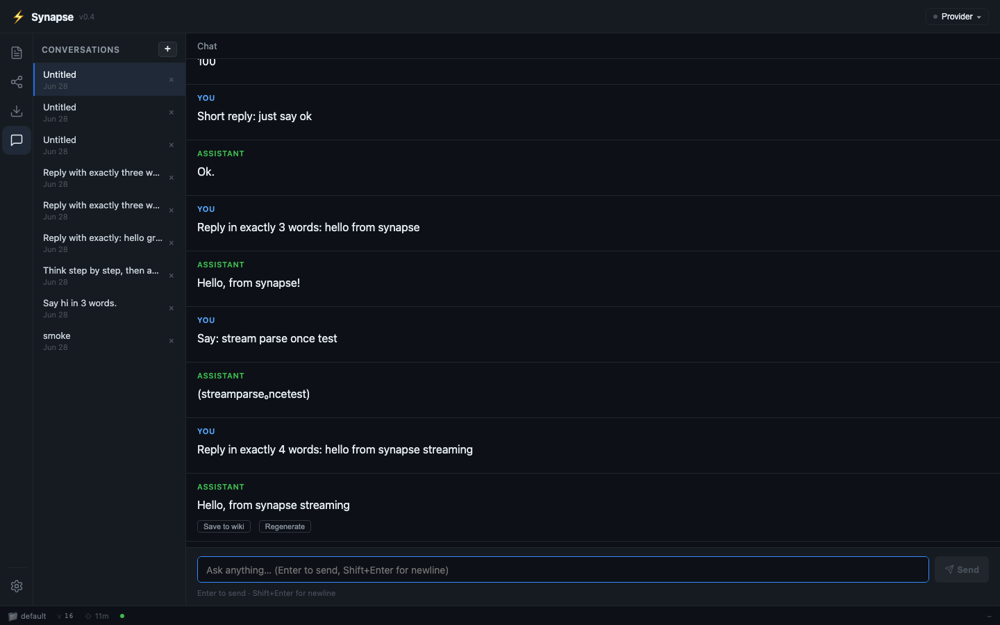
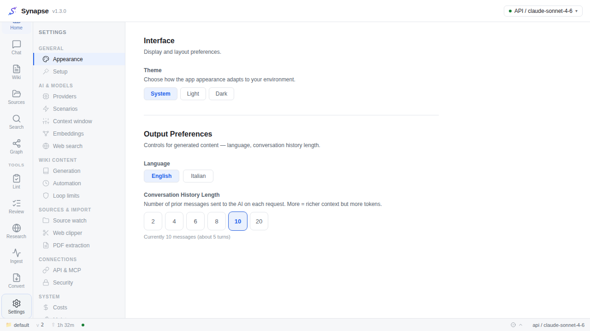
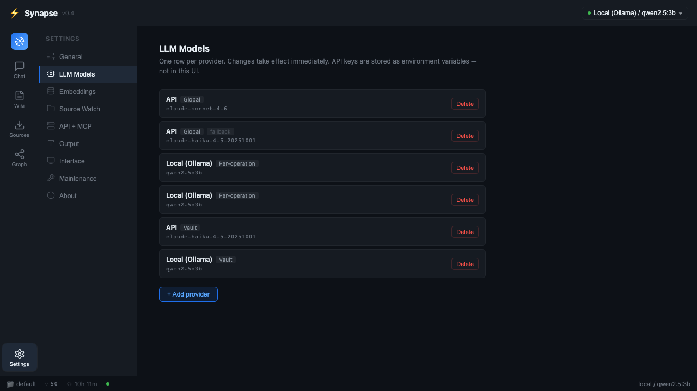
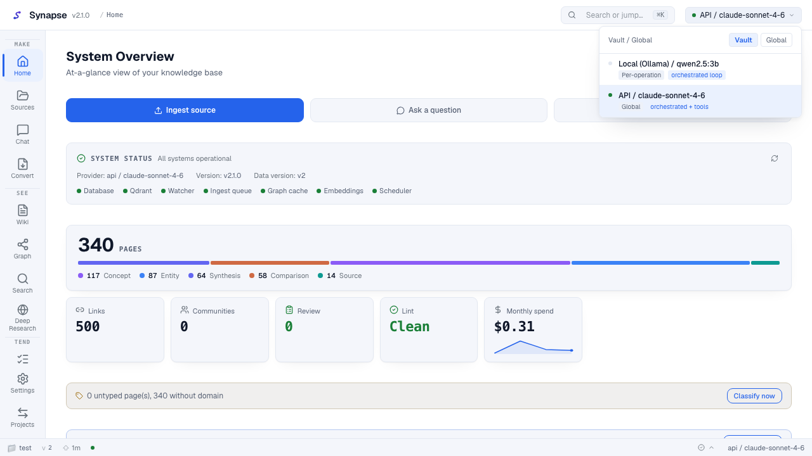
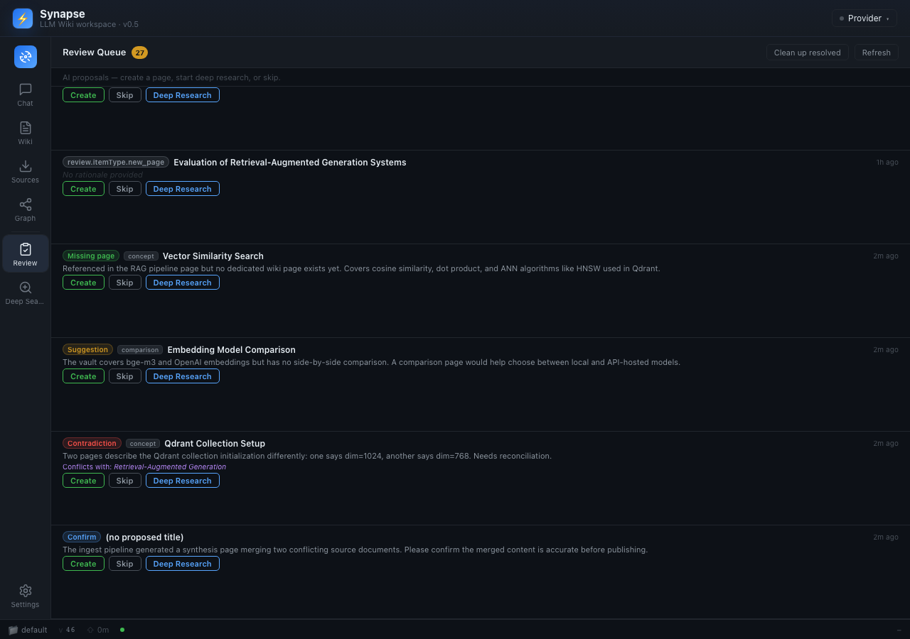
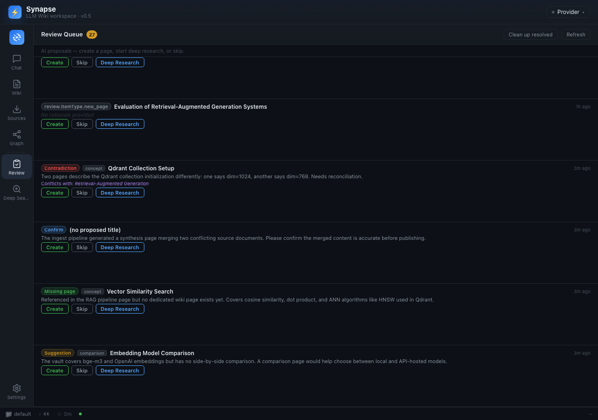

# Synapse User Guide

<!-- Generated: v1.2 sprint 12 | 2026-07-03 -->

> Version: v1.2 (M12 — "Home & Insights": Home dashboard, domain vocabulary + auto-tag, server release channel)
> Language toggle: English / Italian available in Settings.

---

## What is Synapse?

Synapse is a self-hosted web service that turns a folder of raw documents into a
self-organizing knowledge wiki. Drop a file into `vault/raw/sources/`, and Synapse
will analyze it with a configurable AI provider, create structured wiki pages in
`vault/wiki/`, link them to related concepts, and lay out the whole knowledge graph
for you to explore.

The design follows the Karpathy LLM Wiki pattern: the AI maintains the wiki, and you
curate it. The `wiki/` folder is a valid Obsidian vault you can open directly in the
Obsidian app.

---

## The core journey

1. **Open the app** — you land on the Home dashboard by default (v1.2). Glance at the
   KPI row and domain section cards, then navigate using the labeled rail on the left.
2. **Drop a document** into `vault/raw/sources/` (or use the upload zone in the
   Sources section).
3. **Watch the graph grow** — the knowledge graph updates automatically as pages are
   created.
4. **Inspect a page** — click any node on the graph or row in the Wiki tree to read
   its metadata and relationships.
5. **Chat with your wiki** — ask questions in the Chat section; answers stream in
   token by token.
6. **Configure your provider** — add, edit, or delete inference providers from
   Settings > LLM Models; select the active one from the header dropdown.

---

## The interface

Synapse uses a dark-themed shell. A labeled navigation rail on the left lets you switch
between sections without a page reload.



### Navigation rail

The leftmost strip is approximately 72 px wide. Each item shows an icon and a
persistent text label below it. The active section is highlighted with a rounded
rectangle that encloses both icon and label.

The rail contains items from top to bottom:

| Label | Section |
|-------|---------|
| **Home** | Landing dashboard — vault KPIs, recent activity, domain section cards (v1.2, default on first load) |
| **Chat** | Multi-conversation streaming chat |
| **Wiki** | File tree + knowledge graph + page inspector |
| **Sources** | Raw source file browser |
| **Search** | Full-text and semantic search across wiki pages |
| **Graph** | Full-bleed sigma knowledge graph |
| **Lint** | Bounded wiki health check — flag and fix structural issues |
| **Review** | HITL proposal queue — act on AI-proposed follow-up work |
| **Deep Research** | Web-search loop via SearXNG — synthesize and auto-ingest |
| **Ingest** | Ingest run history and cost ledger |
| **Convert** | Dedicated Marker PDF conversion surface (v1.1) |
| **Settings** (pinned at bottom) | All runtime configuration — 5 groups |

The nav rail groups secondary tools (**Lint**, **Review**, **Deep Research**, **Ingest**, **Convert**) in a collapsible "Tools" section below the primary items.

The vault name, data version, and active provider appear in the status bar at the
bottom of every section.

---

### Home dashboard (v1.2) {#home-dashboard}

The Home section is the default landing screen as of v1.2. It loads once on mount
(no polling — I3) and answers "what is in my wiki and how is it growing?" at a glance.

<!-- Screenshot: docs/screens/home-dashboard.png (captured by Playwright E2E — pending QA pass, AC-R12-1-9) -->

#### KPI row

Seven compact cards span the top of the screen:

| Card | What it shows |
|------|--------------|
| **Pages** | Total live (non-deleted) wiki pages |
| **Links** | Total structural wikilink edges in the knowledge graph |
| **Communities** | Number of distinct communities detected by the graph algorithm (0 if graph has not been computed yet) |
| **Review** | Open items in the HITL review queue — highlighted in accent color when non-zero |
| **Lint** | Open lint findings — highlighted in accent color when non-zero |
| **Monthly AI spend** | Month-to-date provider cost in USD, aggregated from the same data as the cost dashboard (`GET /costs/summary`). Local Ollama runs always show $0.00. |
| **Data version** | The current `data_version` counter — increments on every page write. |

#### Recent activity

Below the KPI row, a list of the ten most recently updated wiki pages. Each row shows
the page title and a relative timestamp. Clicking a row navigates to the **Wiki**
section (the tree and note reader load with that page selected in a future sprint;
for now clicking switches to the Wiki section).

#### Server update banner (v1.2)

When the frontend version and the backend version reported by `GET /status` differ —
and the backend version is not `"dev"` — a non-blocking dismissible banner appears at
the top of every section:

> "A server update is available (backend v1.2.0 / frontend v1.1.3). Pull the new image
> on TrueNAS to update."

The banner survives component re-renders but clears when you close and reopen the
browser tab (stored in `sessionStorage`). It does not block any action. See
[DEPLOY.md §9](DEPLOY.md#updating-synapse) for the manual and automatic update
procedures.

#### Domain section cards {#home-sections}

Below recent activity, a responsive grid shows one card per domain in your vocabulary
(in vocabulary order), followed by an **Unclassified** card at the end. Each card
displays:

- **Domain name** and **page count**
- A color-coded mini-bar that shows the type breakdown (concept, entity, source,
  synthesis, comparison) at a glance as a proportional SVG bar — no charting library,
  computed once on mount (I3).
- The type counts in text form below the bar.
- The **last activity** timestamp (most recent `updated_at` among pages in that domain).
- Up to three of the **most-connected pages** in that domain (by graph degree).

**Clicking a card** writes the domain name to `localStorage` (key:
`synapse:domainFilter`) and switches the nav rail to the **Wiki** section. The Wiki
tree reads that filter on its next mount and shows only pages tagged with that domain.
Clicking the **Unclassified** card clears the filter and shows all untagged pages.

**When no vocabulary is configured.** If `domain_vocabulary` is unset or empty, the
section cards area shows a "No domains configured" placeholder with a shortcut button
to **Settings > Advanced** where you can define the vocabulary. The KPI row is always
visible regardless of vocabulary state.

**When the backend does not support the stats endpoints** (running a pre-v1.2 image),
the dashboard shows a friendly placeholder message rather than an error.

---

### Domain sections (v1.2) {#domain-sections}

Domain sections let you slice the wiki by subject area (e.g. ServiceNow, SAM,
Procurement, Regolamentazioni, TPRM). Each domain in your vocabulary becomes a section
card on the Home dashboard and a filter target for the Wiki tree.

#### Defining the vocabulary

1. Open **Settings** from the nav rail (bottom, pinned).
2. Select **Advanced** from the left sub-navigation.
3. Find **Domain vocabulary** in the "Runtime overrides" group.
4. Enter your domain names as a comma-separated list, for example:
   `ServiceNow, SAM, Procurement, Regolamentazioni, TPRM`
   Do **not** type the `domain/` prefix — that is an internal implementation detail
   that the UI hides from you. You type `ServiceNow`, not `domain/ServiceNow`.
5. Click **Save**. The vocabulary is stored as a JSON array in the `app_config` table
   and takes effect immediately for the next ingest and for `GET /stats/sections`.

The vocabulary is editable at any time. Removing a domain does not delete the `domain/*`
tags already written to pages — those tags become "stale" and are silently ignored by
the stats and Home dashboard. A backfill with `force=true` (see below) re-classifies
all pages against the updated list if you want to clean up stale tags.

An empty vocabulary (`[]`) makes the feature dormant: no provider calls are made during
ingest, `GET /stats/sections` returns only the **Unclassified** bucket, and the Home
dashboard shows no domain cards.

#### Auto-tagging on ingest

When the vocabulary is non-empty, the ingest pipeline runs one bounded provider call per
page after it has been written. The provider receives the page title, a bounded slice of
the body, and the full vocabulary list. It returns the subset of vocabulary terms (0 or
more) that match. These are written to `pages.tags` as `domain/<Name>` entries
(Obsidian nested tags — they round-trip through YAML frontmatter and appear in
Obsidian's tag pane under the `domain/` group).

The auto-tag step uses whichever inference provider you have selected (Local / API /
CLI) and is I6-compliant — no backend is hardcoded. Its cost rolls into the ingest
run's `total_cost_usd` and appears in the cost dashboard.

If the classification call fails (provider error, timeout, budget exhaustion), the page
is saved **untagged** — the ingest run is not affected. Auto-tag is advisory and never
blocks ingest.

#### One-time backfill for existing pages

Pages ingested before you defined the vocabulary (or after you changed it) are not
automatically re-classified. To tag existing pages, trigger the backfill via the API:

```bash
# Start a bounded background backfill (202 Accepted)
curl -X POST http://localhost:8000/ops/backfill-domains \
     -H "Authorization: Bearer $SYNAPSE_AUTH_TOKEN" \
     -H "Content-Type: application/json" \
     -d '{}'
```

There is no UI button for the backfill in v1.2 — use the `curl` command above or any
HTTP client. The endpoint returns `202 Accepted` immediately; the backfill runs in the
background.

**Bounds (I7):**

| Parameter | Default | Hard cap | Effect |
|-----------|---------|----------|--------|
| `max_pages` | 500 | 2000 | Stop after this many pages |
| `token_budget` | 60 000 tokens | — | Stop before exceeding this token count |

To process more than 500 pages, pass `"max_pages": 2000` in the request body and
re-run as needed until all pages are tagged. Each run skips pages that already carry a
`domain/*` tag (idempotent by default).

**`force=true`** re-classifies all pages regardless of existing domain tags. Use this
after editing the vocabulary to bring all pages in line with the new list.

```bash
# Force re-classification of all pages (up to max_pages)
curl -X POST http://localhost:8000/ops/backfill-domains \
     -H "Authorization: Bearer $SYNAPSE_AUTH_TOKEN" \
     -H "Content-Type: application/json" \
     -d '{"max_pages": 2000, "force": true}'
```

**Checking status while running:**

```bash
curl http://localhost:8000/ops/backfill-domains \
     -H "Authorization: Bearer $SYNAPSE_AUTH_TOKEN"
```

Returns `{"running": true, "last_summary": null}` while in progress and
`{"running": false, "last_summary": {...}}` with the completion summary once done.
The summary includes `pages_tagged`, `total_cost_usd`, and `stopped_reason` (one of
`complete`, `budget`, `maxpages`, or `vocabulary_empty`).

**Concurrent backfill guard:** only one backfill can run at a time. A second `POST`
while one is in flight returns `409 Conflict`. If the vocabulary is empty, the endpoint
returns `400 Bad Request`.

#### Scheduling lint and domain backfill (v1.2) {#job-scheduling}

Both the lint scan and the domain backfill can run **automatically on a schedule** —
no cron, no curl. Open **Settings > Advanced > Job scheduling** ("Pianificazione
lavori"): each job has a frequency selector (**Off / Hourly / Daily / Weekly**,
default Off), a **Run now** button, and a last-run line with the outcome.

- **Lint scan** finds structural/semantic problems and files them in the Lint section.
  Applying fixes stays a manual, human-approved action — the schedule only runs the scan.
- **Domain backfill** runs with `force=false`: it only classifies new/untagged pages, so
  a recurring schedule is cheap once the initial backfill is done.
- Only one run per job can be in flight (a second trigger is refused); a scheduled
  backfill is skipped while the vocabulary is empty.
- Frequencies are stored as runtime settings (`lint_schedule`, `backfill_schedule`) —
  changed live, no restart needed. The schedule clock resets on backend restart.

---

### Wiki section

The Wiki section (nav label: **Wiki**) has the classic three-panel layout: a page tree
on the left, a note reader/editor in the center, and a metadata inspector on the right.
Left and right panels can be collapsed by clicking the chevron button on their inner
edge; click the chevron again to expand.


**Left panel — page tree.** Wiki pages grouped by type (concept, entity, source,
synthesis, comparison). Click any row to select that page: its content loads in the
center panel and its metadata loads in the right panel. Click the `‹` chevron on the
right edge of the left panel to collapse it and reclaim screen space.

**New page button.** A `+` icon appears in the header of the left panel (top-right
corner of the tree). Clicking it opens a small inline form where you enter a title and
choose a page type. Confirming creates a stub wiki page directly in `vault/wiki/` with
valid YAML frontmatter, adds it to the tree, and opens it immediately in the center
panel. The page is incremental (one `data_version` bump, one graph node added — no
rescan, I1).

**Center panel — note reader/editor (NoteView).** Shows the raw markdown of the
selected wiki page (including YAML frontmatter) in a read-only view by default.
Click **Edit** (top-right of the panel) to switch to the CodeMirror 6 editor.
When you are done editing, click **Save** to write the changes back. The backend
applies an optimistic-lock check: if another process (or you in a second tab) changed
the file since you opened it, you will see a "content changed on disk — please reload"
message and the save will be rejected to prevent data loss. Reload the page to get the
latest content and try again.

Saving re-indexes the page inline (links, embeddings, graph) without rescanning the
vault (I1). One graph version bump fires the debounced graph recompute so the Graph
section updates automatically within a few seconds.

> Note: the full-bleed knowledge graph used to appear in the center panel of the Wiki
> section. As of v0.5, the graph lives exclusively in the dedicated **Graph** section
> (nav label: **Graph**). The Wiki section center panel is now the note editor.

**Right panel — inspector.** Shows the selected page's frontmatter (title, type,
sources) and its relationships (pages it links to and pages that link back to it).
Click the `›` chevron on the left edge of the right panel to collapse it.

---

### Reading and editing wiki notes

Synapse lets you read and edit any `wiki/` page directly in the browser using the
CodeMirror 6 editor, without leaving the app.

**To read a note:**

1. Navigate to the **Wiki** section using the nav rail.
2. Click any page in the left-panel tree. The page's raw markdown (including YAML
   frontmatter and `[[wikilinks]]`) appears in the center panel.

**To edit a note:**

1. Select a page in the tree (center panel shows its content).
2. Click **Edit** (top-right corner of the center panel). The panel switches to
   CodeMirror 6 editor mode.
3. Make your changes. The editor supports syntax highlighting for Markdown and YAML.
4. Click **Save** when you are done.

**What happens on Save:**

- The backend writes the file atomically (temp file + rename — no partial writes).
- YAML frontmatter is validated before writing: if the frontmatter is malformed, the
  save is rejected with a 422 error and the file on disk is NOT changed.
- The backend re-indexes the page inline: wikilinks are re-parsed, embeddings updated,
  and the graph version is bumped — all for this single page, with no full rescan (I1).
- The Graph section updates automatically (debounced, within about 5 seconds).

**Unsaved-changes guard.** If you navigate away from a page while the CodeMirror editor
has unsaved changes, Synapse intercepts the navigation and shows an "Unsaved changes —
continue?" dialog with **Stay** and **Discard changes** buttons. Clicking **Stay**
returns you to the editor so you can save; clicking **Discard changes** navigates away
and discards your edits. No edits are silently lost by clicking a row in the tree,
switching sections, or closing the panel.

**If the note changed on disk while you were editing:**

You will see a "reload required" message (HTTP 409). This means someone else (or a
background ingest run) updated the same file since you opened it. Click **Reload** in
the center panel to fetch the latest content. Your unsaved edits will be lost — copy
them to a clipboard before reloading if needed.

**Important constraints:**

- You can only edit pages inside `vault/wiki/`. Raw source files in `vault/raw/sources/`
  are read-only in the editor (the backend returns 403 for those paths — K1 vault layer
  separation).
- The maximum editable page size is 4 MB (`MAX_PAGE_CONTENT_BYTES`). Files larger than
  this are displayed read-only with a size warning.
- The graph is not in the Wiki section center panel. Use the **Graph** section (nav rail)
  to view the full-bleed sigma knowledge graph.

---

### Graph section

The full-bleed knowledge graph. This section shows only the graph canvas — no tree or
inspector. Use the Wiki section if you want the graph alongside the page tree.



- **Node size** scales with the number of structural connections (direct wikilinks and
  shared-source provenance). Larger nodes are more connected.
- **Node color** encodes page type. The legend is always visible in the bottom-left
  corner.
- **Hover** lights up the hovered node and its immediate neighbors. Everything else
  fades to a low opacity so the local neighborhood is easy to read.
- **Drag** a node to reposition it. The new position persists across graph recomputes;
  a dragged node keeps its location even when new pages are ingested.
- **Click** a node to select it. The selected node title is announced for screen
  readers.

The layout is computed server-side (ForceAtlas2 offline). The browser never runs a
force-directed layout, so the UI stays responsive regardless of graph size.

#### Graph drill-down — communities and edge signals (v0.9)

**Community panel.** Nodes are grouped into communities by the Louvain algorithm.
Click on a colored community area (or on a node belonging to a community) to open the
community detail panel on the right side of the Graph section. The panel shows:

- **Member list** — every page in the community, clickable to open that page in the
  Wiki section.
- **Cohesion score** — a number between 0 and 1 representing how tightly connected the
  community is internally. The score is `intra-community edges / possible intra-community
  edges`. A score below 0.15 is flagged with a warning indicator, meaning the community
  is sparse and its members may not be strongly related. If `GRAPH_COHESION_WARN` is set
  by the operator, the threshold can be adjusted.
- The community panel is powered by `GET /graph/communities/{id}` and loads on demand
  (only when you click a community — no data is prefetched).

**Edge signal breakdown.** Click any edge between two nodes to open an edge detail
panel showing the decomposition of that edge's relevance weight into its four
contributing signals:

| Signal | Weight coefficient | What it measures |
|--------|-------------------|-----------------|
| Direct wikilinks | 3.0 | Number of `[[wikilinks]]` between the two pages |
| Shared sources | 4.0 | Number of raw source files that both pages derive from |
| Adamic-Adar index | 1.5 | Common-neighbor structural similarity |
| Type affinity | 1.0 | Cross-type bonus or same-type penalty from the type matrix |

The breakdown helps you understand why two pages are connected and how strongly. A high
shared-sources score means both pages were generated from the same source document. A
high direct-wikilinks score means the pages explicitly reference each other. The edge
detail panel is powered by `GET /graph/edges/{source_id}/{target_id}` and loads on
demand.

---

### Sources section

The Sources section (nav label: **Sources**) shows the history of all ingest runs for
the current vault and provides two ways to add documents directly from the browser.



#### Uploading a document

The top of the Sources section contains a drag-and-drop upload zone.

- **Drag** a Markdown or plain-text file (`.md`, `.txt`, `.markdown`) onto the zone, or
  click **Browse** to open a file picker.
- Synapse saves the file to `vault/raw/sources/` and the watcher ingests it
  asynchronously. A new run row appears in the list within about 15–30 seconds.
- **Accepted formats in v0.8:** Markdown, plain text (`.md`, `.txt`, `.markdown`), PDF,
  DOCX, PPTX, XLSX, images (`.png`, `.jpg`, `.jpeg`, `.webp`), and audio/video
  (`.mp3`, `.m4a`, `.wav`, `.mp4`, `.mov`, `.webm`). Binary office files are
  automatically converted to a companion `.extracted.md` file for ingest (F12,
  ADR-0025). Image files produce an AI-generated caption (see Image captions below);
  audio/video files are transcribed to text (see Audio/video transcription below).
  The original binary is stored in `vault/raw/sources/`.
- **Size limit:** 25 MB per file (configurable by the operator via `MAX_UPLOAD_BYTES`).
  Larger files are rejected with a message before any data is saved.
- If you upload a file whose name already exists in `vault/raw/sources/`, the existing
  file is replaced and re-ingested (correct incremental behaviour — only the changed
  content is re-processed).

#### Run history

Each row in the list below the upload zone displays:

- **Status badge** — Running (pulsing), Completed, Failed, or Did not converge.
- **Provider** — which inference backend handled the run (Local Ollama, API, or CLI).
- **Pages created** — how many wiki pages this run produced.
- **Cost** — total provider cost in USD to four decimal places (e.g. `$0.0512`). Local
  Ollama runs always show `$0.0000`.
- **Relative time** — "3 hours ago", "yesterday", etc.

Click a row to expand its details in the right panel (error message if failed, full
cost breakdown).

**Run Ingest button** — triggers a new ingest run against the current vault using the
active provider. On success a toast confirms the run started and the list refreshes.
The list polls automatically while any run has status Running.

After each ingest run the backend runs a proposal stage and emits review items for
genuinely useful follow-up work (missing pages, research gaps, contradictions). Visit
the **Review** section in the nav rail to act on them.

#### Bulk select in Sources

A **Select** button in the Sources section header activates bulk-select mode. In this
mode:

- Each row in the file tree gains a checkbox. Click a checkbox (or the row itself) to
  toggle selection.
- A **Select all** checkbox in the header selects or deselects every visible file at once.
- The header shows a count of selected items (e.g. "3 selected").
- A **Delete selected** button cascade-deletes all selected source files and their
  derived wiki pages in one backend call (same cascade-delete logic as the single-file
  delete — mandatory dry-run results are shown in a confirmation dialog before the
  destructive apply).
- Press **Esc** or click **Cancel** to exit bulk-select mode without deleting anything.

Bulk select is useful when you want to remove a batch of draft sources that produced
overlapping pages, or when cleaning up failed ingest runs.

---

### Convert section

The Convert section (nav label: **Convert**) is the dedicated surface for converting
PDF files with the Marker microservice and automatically ingesting the results. It is a
first-class section, not a button inside the Sources section.

Marker is **optional**. If you do not run the Marker microservice, the Convert section
is still accessible but the action button will be disabled. The default PDF extractor
is pypdf, which requires no microservice. See [Converting PDFs with Marker](#converting-pdfs-marker)
for full details.

**How to use the Convert section:**

1. Navigate to **Convert** in the nav rail (under the Tools group).
2. Check the Marker status badge at the top of the panel.
   - Green badge ("Marker online"): the microservice is reachable and the action is enabled.
   - Red badge ("Marker offline"): the microservice is unreachable; the action button is
     disabled with a tooltip explaining the state.
3. Drag PDF files onto the drop zone, or click the zone to open a file picker.
   The panel accepts only `.pdf` files. Non-PDF files are rejected with an inline message.
   You can queue up to **10 PDF files** per submission (hard limit — I7).
4. Review the per-file list. Each file shows its name and current status (pending, clock
   icon). Click the `X` on a pending row to remove it before converting.
5. Click **Convert & ingest** (disabled when Marker is offline or no files are queued).
   The panel updates each row in real time:
   - Spinning loader: converting.
   - Green check: conversion done; the resulting `.extracted.md` has been written to
     `vault/raw/sources/` and the watcher will ingest it automatically within 15–30 seconds.
   - Red X + error message: Marker returned an error for this file. The error text from
     the backend response is shown inline. No silent fallback to pypdf occurs — if you
     chose Marker, a failure is reported, not swallowed (I7).
6. When at least one file succeeds, a hint appears pointing you to the Sources section
   (or the Wiki tree) to see the new page(s) appear after ingest.
7. Click **Close** (or clear the list) to reset the panel and start a new batch.

**Marker health badge.** The badge is checked once on panel mount. Click the refresh
icon (circular arrow) next to the badge to re-check health at any time — useful if you
just started the Marker service.

**After conversion.** The watcher picks up each `.extracted.md` file written by the
Convert endpoint and runs the normal incremental ingest (I1 — no full vault rescan).
New wiki pages appear in the tree and graph automatically.

---

### Chat section

The Chat section is a multi-conversation interface backed by the configured inference
provider.



**Left panel — conversation list.** All your past conversations for the current vault.
Create a new one with the `+` button (or press **Cmd/Ctrl+N**). Delete one with the `x`
on hover. Conversations persist across page reloads.

**Automatic conversation titles and list previews (v0.9).** When you send the first
message in a new conversation, Synapse automatically sets the conversation title to the
first 50 characters of your message (trimmed to the last word boundary so it never cuts
mid-word). You do not need to name conversations manually. Each conversation row in the
left panel also shows a one-line preview of the most recent message, so you can identify
conversations at a glance without opening them. If you rename a conversation, the manual
title takes permanent precedence over the auto-title.

**Rename a conversation.** Double-click the conversation title in the list (or click the
pencil icon on hover) to edit it inline. Press **Enter** or click away to save; press
**Esc** to cancel. The title is persisted immediately via `PATCH /conversations/{id}`.
Synapse auto-titles a new conversation from the first 50 characters of the first user
message; renaming overrides that auto-title permanently.

**Filter conversations.** A search box at the top of the conversation list filters rows
in real time by title (case-insensitive substring match). Clear the field to see all
conversations. The filter is local to the panel and does not send any request to the
backend.

**Starting a conversation — example prompts.** When a conversation has no messages yet,
the center panel shows the Synapse logo and three clickable example-question chips. Click
any chip to send that question immediately, exactly as if you had typed it and pressed
Enter. The chips are a quick way to explore your vault without having to think of a first
question; you can still type your own message at any time.

**Center panel — message thread.** Each user message appears in teal; assistant
replies in green. Responses stream token by token as they arrive — you see the reply
build in real time. A **Stop** button interrupts a stream in progress.

When the response is complete, two buttons appear under the assistant message:
- **Regenerate** — re-sends your last message and replaces the previous reply.
- **Save to wiki** — active in v0.5; creates a new wiki page from the conversation
  turn via `POST /ingest/from-text` (F6, ADR-0019 §2.7).

**Reasoning (`<think>`) blocks.** If the model produces a `<think>…</think>` section
(for example when using a reasoning-capable model), it is shown in a collapsible
"Reasoning" section, collapsed by default. Click it to expand.

**GFM and LaTeX.** Assistant responses are rendered as GitHub-flavored Markdown
(tables, task lists, strikethrough). LaTeX expressions (`\alpha`, `\sum`, etc.) are
converted to Unicode at the end of the stream, not per token. Complex display math
that cannot be converted is left as a fenced code block.



---

### Settings section

The Settings section uses a two-column layout: a left sub-navigation list of five
top-level groups and a right content pane that shows the selected group. Click any item
to switch the pane without a page reload. (v1.1: the previous 14-section flat list was
consolidated into five plain-language groups — A2.1.)



The five groups are:

| Group | Contents |
|-------|----------|
| **Getting started** | Context window and token-budget bar chart; Setup wizard re-open button |
| **AI & Models** | LLM provider CRUD; vector embeddings toggle and format; web search URL; API + MCP details |
| **Sources & PDF** | Automatic folder import (Source Watch); web clipper; **PDF extractor and Marker runtime settings** (v1.1) |
| **Output & Appearance** | Conversation history length; language toggle; theme; scenarios |
| **Advanced** | Cost dashboard; security (token rotation); maintenance; About; remaining runtime overrides (v1.1) |

#### Getting started

The Getting started group contains two items:

**Context window.** Choose how many tokens Synapse sends to the model per request: 4K,
8K, 16K, 32K (default), 64K, 128K, 256K, 512K, or 1M. The token budget is split
60 % conversation history / 20 % retrieved context / 5 % system prompt / 15 % generation
headroom. The bar chart visualizes absolute token counts for the chosen window size.

**Setup wizard.** A "Re-open setup wizard" button re-launches the first-run guided
wizard (A2.2). The wizard walks through backend health check, inference provider choice,
and PDF extractor selection. It is skippable at any step and writes only through the
same runtime-settings endpoints described in [Runtime Settings](#runtime-settings).
The wizard is shown automatically when the app has no saved configuration; use this
button to return to it at any time.

#### LLM Models

The LLM Models section lists all configured inference providers. Each row shows the
provider type (Local Ollama, API, or CLI), the model ID, and the scope (Global or
Per-operation). Use this section to manage providers without editing the database.



**Viewing providers.** The list is loaded from the backend on every visit. The
currently active provider is shown in the header.

**Adding a provider.** Click **+ Add provider** to expand the add form. Choose the
provider type, enter a model ID (required), optionally enter a base URL (for
OpenAI-compatible endpoints), and select a scope. The **Add** button is disabled until
you enter a model ID. On success, the new row appears in the list immediately.

**Deleting a provider.** Click **Delete** on any row. A confirmation prompt appears
before the deletion is sent. If you are about to delete the last remaining provider, a
warning is shown explaining that ingest and chat will fail without a provider — the
deletion is still allowed, because a misconfigured sole provider should always be
replaceable.

#### Scenarios {#settings-scenarios}

The Scenarios section gives you five ready-made vault presets, each tuned for a
different knowledge-building style. Applying a scenario rewrites `vault/purpose.md` and
`vault/schema.md` with pre-written goal, key questions, and frontmatter rules for that
use case, then bumps the vault data version so the graph refreshes automatically.

| Preset | Vault focus |
|--------|------------|
| **Research** | Academic or professional research; citations, hypotheses, methodology, evidence, conclusions |
| **Reading** | Book and article notes; summaries, themes, vocabulary, author context |
| **Personal Growth** | Habits, goals, reflections, journaling, skills, and self-improvement tracking |
| **Business** | Strategy, market analysis, product, operations, stakeholders |
| **General** | Balanced default; minimal schema constraints; suitable for any mixed-topic vault |

**How to apply a scenario:**

1. Open **Settings > Scenarios**.
2. Read the short description under each preset card.
3. Click **Apply** on the preset you want. A confirmation dialog explains that
   `purpose.md` and `schema.md` will be overwritten.
4. Confirm. The backend writes both files and bumps the data version. The graph
   refreshes in the background (debounced, within about 5 seconds).

**Important:** applying a scenario overwrites the current `purpose.md` and `schema.md`
completely. If you have hand-crafted either file, copy its contents to a safe place
before applying a preset. Scenarios are intended for first-time vault setup or for
switching a vault to a new purpose — not for incremental tweaks. You can edit the
resulting files manually in the Wiki editor after applying.

The scenario definitions are read-only (built into the backend); you cannot create
custom scenarios from the UI in v0.7.

#### Output

**Conversation history length.** Choose how many past messages are sent to the model
with each new chat message: 2, 4, 6, 8, 10, or 20. A smaller history reduces token
cost; a larger history gives the model more context. The setting is persisted in
browser local storage.

**Language.** Toggle between English and Italian. The UI switches immediately; no
reload needed.

#### Source Watch (automatic import)

The Source Watch section (previously called "Automatic import") lets Synapse
periodically scan a mounted folder inside the backend container and import any new or
changed documents automatically — no manual drag-and-drop required.

**How to set it up:**

1. The backend can only see folders that have been mounted into its container. Add a
   bind-mount to `docker-compose.yml` (see [DEPLOY.md §8](DEPLOY.md)) and restart the
   stack. Example: `./import:/import:ro` makes the host folder `./import` visible inside
   the container as `/import`.
2. In Settings > **Source Watch**, enable the toggle.
3. Enter the **container path** (e.g. `/import`). This is the path inside the container,
   not your host machine's path. If the path is not accessible inside the container, a
   warning appears — add the mount and it resolves on the next scan.
4. Choose a **frequency**: every 15 minutes, every hour, every 6 hours, or daily.
5. Click **Save** (or the card auto-saves on change). The scheduler picks up the new
   settings on its next tick without a restart.

The **Run now** button triggers an immediate scan outside the normal schedule. Use it
to test your setup or import a batch without waiting for the next scheduled tick.

After each scan the card shows "Last scan: N minutes ago — M imported". The number is
how many files were copied into `vault/raw/sources/` (new or changed content only —
identical files are skipped). Actual ingest runs for those files appear in the Sources
section with their normal status and cost.

**Important constraints:**
- As of v0.8, Markdown, plain text, PDF, DOCX, PPTX, XLSX, images, and audio/video
  files are imported (F12). Binary office files are converted to a companion
  `.extracted.md` before ingest. Images require `VISION_CAPTIONS_ENABLED=true`; audio
  and video require `AV_TRANSCRIPTION_ENABLED=true` (both opt-in — see the operator
  env var reference in DEPLOY.md §2.1). Files of unrecognized types are silently
  skipped.
- The scan is non-recursive: only files directly inside the configured folder are
  imported, not files in sub-folders.
- Each scan copies at most 200 files and runs for at most 60 seconds (both limits are
  configurable by the operator). Remaining files are picked up on the next tick.
- A scan that is already in progress will not overlap with a new tick or a "Run now"
  request.

#### Interface {#settings-interface}

The Interface section controls the visual theme of the app.

**Theme.** Three options are available from a selector in Settings > Interface:

| Option | Behaviour |
|--------|-----------|
| **Light** | Always uses the light palette, regardless of OS setting. |
| **Dark** | Always uses the dark palette, regardless of OS setting. |
| **System** | Follows the OS appearance setting. If you switch your OS between light and dark mode, the app updates live — no page reload needed. |

The selected theme is persisted in your browser's local storage. CodeMirror (the note editor) automatically switches between its default light theme and the One Dark theme to match. The knowledge graph's canvas background and label colors also follow the resolved theme.

#### Costi (cost dashboard) {#settings-costi}

The Costi section (Settings > **Advanced** > cost dashboard, shipped in v0.9) shows a
live breakdown of what you have spent running Synapse's AI providers.

**What it displays:**

- A monthly cost rollup by provider type and operation (ingest, chat, lint, deep research,
  review sweep). Each row shows the provider name, operation, and total USD to four decimal
  places.
- A **monthly total** line that sums across all providers and operations for the current
  calendar month.
- An **alert indicator** that turns red when the month-to-date total exceeds the
  `COST_ALERT_THRESHOLD_USD` value configured by the operator (see DEPLOY.md §2.1).
  The indicator is informational only — Synapse does not pause or block AI calls when the
  threshold is reached. It is a visibility signal, not a hard cap.

The data comes from `GET /costs/summary`, which aggregates `total_cost_usd` columns
recorded on `ingest_runs`, `deep_research_runs`, `lint_runs`, and `messages` tables.
Local Ollama runs always contribute `$0.0000` to the total.

**What it does not show:**

- Per-conversation or per-page granularity. That detail lives in the Sources run history
  (click any run row to expand the full cost breakdown for that specific ingest).
- Costs before the current month. Historical data is retained in the database but the
  dashboard only displays the running month total and the current month's per-row
  breakdown. If you need historical detail, query the database directly or export
  `GET /export/data.json`.

**Operator and user note:** the alert threshold can be set at deploy time via the
`COST_ALERT_THRESHOLD_USD` env var (see DEPLOY.md §2.1), or changed at runtime via
**Settings > Advanced** without restarting Docker (v1.1 — see
[Runtime Settings](#runtime-settings), "Monthly cost alert").

---

### Command palette {#command-palette}

The command palette gives keyboard-first access to every section and every wiki page in one step.

**Opening and closing:**

- Press **Cmd+K** (macOS) or **Ctrl+K** (Windows / Linux) to toggle the palette open or closed.
- Press **Esc** to close without navigating.
- The shortcut works even when the note editor has focus.

**Navigating results:**

1. Start typing to filter by title. The palette searches app sections and all wiki page titles simultaneously, returning up to 20 results.
2. Press **↑** / **↓** to move between results.
3. Press **Enter** to open the selected item. Sections switch the active nav-rail item; wiki pages open in the Wiki section note reader.

**Keyboard shortcuts (no palette needed):**

| Shortcut | Action |
|----------|--------|
| **Cmd/Ctrl+K** | Open / close command palette |
| **Cmd/Ctrl+N** | New conversation (Chat section) |
| **Cmd/Ctrl+1** | Switch to section 1 (Chat) |
| **Cmd/Ctrl+2** | Switch to section 2 (Wiki) |
| **Cmd/Ctrl+3** | Switch to section 3 (Sources) |
| **Cmd/Ctrl+4** | Switch to section 4 (Graph) |
| **Cmd/Ctrl+5** | Switch to section 5 (Review) |

The section-switch and new-conversation shortcuts are ignored while you are typing in a text input or the note editor (to avoid conflicts), except for Cmd/Ctrl+K which remains reachable from any context.

---

### Provider selector

The header shows the currently active provider. Click the provider name to open the
dropdown.



Three provider types are available:

| Type | Backend | Cost | Best for |
|------|---------|------|---------|
| **Local** | Ollama on the RTX 3060 | Free | Privacy-sensitive vaults; offline use |
| **API** | Anthropic API or OpenAI-compatible endpoint | Pay-per-token | Quality; default recommendation |
| **CLI** | claude-agent-sdk | Pay-per-token | Maximum quality; full agentic ingest loop |

Select a provider and choose the scope: **Global** (applies to all operations) or
**Vault** (overrides for the current vault only). The change takes effect immediately
for the next chat message or ingest run; no page reload needed.

---

## Ingesting your first document

There are three ways to get a document into Synapse:

**Option 1 — Drag and drop in the browser.** Open the Sources section and drop a
`.md` or `.txt` file onto the upload zone (or click Browse). The watcher ingests it
asynchronously; a new run row appears within about 15–30 seconds.

**Option 2 — Place the file directly.** Copy or move a file into `vault/raw/sources/`
on the host. The file watcher detects it and ingests it automatically. You can also
trigger a run manually with the **Run Ingest** button in the Sources section.

**Option 3 — Scheduled folder import.** Configure Settings > Source Watch to scan a
mounted folder on a regular schedule. Any new or changed documents are imported
automatically without manual action (see the Source Watch sub-section above).

Supported formats in v0.8: Markdown, plain text, PDF, DOCX, PPTX, XLSX, images
(PNG/JPEG/WebP), and audio/video (MP3/M4A/WAV/MP4/MOV/WebM) (F12). Image
captions and AV transcription are opt-in via operator env vars (see below).

After ingest, the Sources section shows a Running row that changes to Completed once
the AI has finished generating wiki pages. Switch to the Graph or Wiki section to see
the new nodes appear.

---

### Review section

The Review section (nav label: **Review**) shows the HITL (human-in-the-loop)
proposal queue that Synapse builds after each ingest run. This is where the AI
proposes follow-up work and you decide what to act on (K8: the LLM proposes,
you curate).



#### How proposals are generated

After each orchestrated ingest run, Synapse runs a single bounded proposal call
(fire-and-forget — the pages are already written and this step never blocks or fails
ingest). An anti-spam gate suppresses the call on trivial runs: the call only fires
when the run wrote substantial content (at least 10 000 characters or at least 4 pages)
or when concrete signals exist (dangling wikilinks, analysis-proposed pages that were
not written). Rule-based proposals (missing pages, duplicates) are emitted without any
LLM call; the single LLM call is reserved for the harder suggestion / contradiction /
confirm judgments.

Each proposal becomes one card in the Review section. The list is paginated and
virtualized for large queues.

#### Five proposal types

| Type | What it means | Typical action |
|------|---------------|---------------|
| `missing-page` | A referenced entity or concept has no wiki page yet. Synapse suggests creating one. | **Create** to generate the page on demand, or **Skip** if the entity is not worth a page. |
| `suggestion` | A research gap or follow-up the AI thinks would strengthen the vault. | **Deep Research** to run a web-search loop, **Skip**, or act manually in Obsidian. |
| `contradiction` | The AI detected a conflict between the new content and an existing wiki page. | **Create** a resolution page, **Deep Research** for more context, or **Skip** to ignore. |
| `duplicate` | The proposed title may collide with an existing page (possible merge candidate). | Review the existing page; **Skip** if they cover distinct topics. |
| `confirm` | The AI wants explicit human confirmation before acting on a finding. | **Create** if confirmed, otherwise **Skip**. The sweep never auto-resolves `confirm` items. |
| `purpose-suggestion` | The AI detected that recent content may have drifted outside the current scope of `purpose.md` (v0.9). | Read the rationale; if you agree, open `purpose.md` in the Wiki editor and incorporate the suggestion. **Skip** if scope has not drifted. |
| `schema-suggestion` | The AI detected a structural pattern in recent pages that does not fit the current `schema.md` rules (v0.9, opt-in). | Read the suggested schema change; apply it manually in the Wiki editor if you agree. **Skip** to leave schema unchanged. Schema suggestions are disabled by default; see the operator opt-in note below. |

#### purpose.md suggestions (v0.9)

After each orchestrated ingest run, Synapse can emit a `purpose-suggestion` review item
when the AI analysis detects that the ingested content consistently falls outside the
vault's stated scope, key questions, or thesis as declared in `purpose.md`. This gives
the vault's guiding document a chance to evolve alongside the content you accumulate
rather than remaining a static template.

A `purpose-suggestion` card in the Review section shows:
- The **rationale** — a brief explanation of what the AI observed (e.g. "Five recent
  sources discuss time-series databases, but purpose.md does not mention operational
  data systems as a scope area").
- No automatic edit is made to `purpose.md`. Clicking Create on this card type does
  not modify any file; it only marks the item resolved. If you agree with the suggestion,
  open `purpose.md` via the Wiki section and edit it yourself.

Purpose suggestions are emitted only when there is a concrete signal of scope drift; the
anti-spam gate (`PURPOSE_SUGGESTION_MIN_SOURCES`, `PURPOSE_SUGGESTION_MIN_TOKENS`) ensures
they do not fire on small or trivial ingest runs. See DEPLOY.md §2.1 for operator
env vars (`PURPOSE_SUGGESTION_ENABLED`, `PURPOSE_SUGGESTION_MAX_TOKENS`,
`PURPOSE_SUGGESTION_TIMEOUT_SECONDS`).

#### schema.md suggestions (v0.9, default off)

Similar to purpose suggestions, `schema-suggestion` review items propose changes to the
structural rules in `schema.md` when the AI detects an emerging frontmatter pattern or
page-type convention that the current rules do not accommodate.

**This feature is disabled by default** (`SCHEMA_SUGGESTION_ENABLED=false`). The operator
must explicitly enable it. The reason for the conservative default: schema changes affect
every future ingest run and every validation pass. An unreviewed schema change can produce
incorrectly structured pages until it is corrected. Always read a schema suggestion
carefully before applying it.

When enabled, schema suggestion cards appear in the Review section with the same three
actions (Create / Deep Research / Skip). Create marks the item reviewed but does not
write to `schema.md`; manual editing is required.

#### The three actions

Each proposal card offers exactly three buttons (no other actions are available):

- **Create** — generates the proposed wiki page on demand. Clicking Create runs the
  bounded orchestrated loop targeting that single page (same AI logic as a normal
  ingest run). The page is written through the same incremental write seam as all other
  pages: one `data_version` bump, one entry in `log.md`, one node in the graph. A
  spinner is shown while generation runs (this takes a few seconds and uses the active
  provider, with cost logged in the Sources run history). On completion the proposal
  card moves to "created" status and the graph refreshes automatically. If generation
  fails, the item remains `pending` so you can retry or skip.

  **Note:** Create replaces the old "Approve" verb from the previous review model. In
  the earlier design, "Approve" was a no-op (the page had already been created). Now
  the page is generated only when you click Create — the AI proposes, you curate (K8).

- **Deep Research** — delegates to the Deep Research loop (F10): Synapse runs a
  multi-query SearXNG web-search cycle, synthesizes the findings, and auto-ingests
  the synthesis as a new wiki page. The proposal topic is derived from the card's
  `proposed_title` or `rationale`. The item moves to `deep_researched` status and a
  link to the research run appears in the Sources section.

- **Skip** — closes the proposal without any action. The item moves to `skipped`
  status and disappears from the pending queue. Skipping is reversible only by
  re-ingesting the source.

#### Auto-resolution sweep

After each ingest run (and after each Create action) Synapse runs an auto-resolution
sweep to close proposals that are no longer relevant:

- **Rule-based pass (no AI cost):** if a `missing-page` or `duplicate` proposal's
  `proposed_title` now matches an existing wiki page title, the item is automatically
  closed (`auto_resolved`). As your wiki grows, these proposals resolve themselves.

- **Conservative LLM pass (optional, bounded):** a single batched call (capped at 8
  items, off-by-default for zero-cost operation — see `REVIEW_SWEEP_LLM_ENABLED`) may
  resolve `suggestion` or `contradiction` items where the LLM judges the concern no
  longer applies. The prompt biases toward keeping items pending on any uncertainty.
  `confirm` items are **never** auto-resolved — they always require human action.

You can also trigger the sweep manually with **POST /review/queue/sweep** (useful after
bulk edits in Obsidian).

> **Note — CLI provider and the review queue (ADR-0025 §7):** when the active provider is
> **CLI** (`CliAgentProvider`), the entire ingest is delegated to the claude-agent-sdk agent
> loop, which writes pages autonomously using in-process MCP tools. In this delegated path,
> the post-ingest proposal stage does **not** run, so no review items are enqueued after a
> CLI-provider ingest. This is a conscious design gap: the review queue is populated only by
> the orchestrated ingest loop (API and Local providers). If you rely on the review queue for
> follow-up curation, use the API or Local provider for ingest and reserve the CLI provider
> for tasks where you want fully autonomous page creation.

#### Screenshots



---

### Lint section

The Lint section (nav label: **Lint**) runs a bounded health check of the wiki (K2, ADR-0037). Unlike ingest, lint never modifies pages autonomously: every finding requires an explicit human action before any change is applied.

**Running a lint scan:**

1. Navigate to **Lint** in the nav rail.
2. Click **Run Lint**. The backend starts a new scan (bounded by `LINT_MAX_ITER` iterations and `LINT_TOKEN_BUDGET` tokens). A spinner appears while the scan runs.
3. When the scan completes, findings are grouped by category in the panel below. The cost line shows the provider cost for any semantic calls made (Local Ollama runs show `$0.0000`).

**Finding categories:**

| Category | What it flags | Action available |
|----------|--------------|-----------------|
| `orphan-page` | A wiki page with no incoming wikilinks (structurally isolated) | Acknowledge only — flag-only per ADR-0037; no automatic edit |
| `contradiction` | The AI detected conflicting claims between two wiki pages | Acknowledge only — flag-only; resolve manually in the editor or via Deep Research |
| `stale-claim` | A claim in a wiki page may be outdated based on newer ingested content | Acknowledge only — flag-only; review and update manually |
| `missing-xref` | A wiki page mentions a concept that has a dedicated page but no `[[wikilink]]` | **Apply** to insert the missing wikilink, or Dismiss |

**Apply vs Acknowledge:**

- **Apply** — available only for `missing-xref` findings. Clicking Apply writes the suggested `[[wikilink]]` into the body of the referencing page (targeted edit, no vault rescan — I1). The edit is written through the same incremental seam as all other page writes: one `data_version` bump, one entry in `log.md`, graph refresh within about 5 seconds.
- **Acknowledge** — used for the three flag-only categories (`orphan-page`, `contradiction`, `stale-claim`). These categories surface observations for human judgment but the Lint section will never edit human-curated content on their behalf (K8). Acknowledging moves the finding to `acknowledged` status and removes it from the active list.
- **Dismiss** — discards a finding without action (works on any category).

The human gate is intentional: scan findings are never auto-applied across a run. You must call **Apply** (or **Acknowledge**) per finding to close it. This keeps the AI in a propose-only role and the human in control of actual content changes (K8).

**Empty state:** when the wiki has no findings, the panel shows "Wiki is healthy — no findings." The Run Lint button remains available to trigger a fresh scan at any time.

---

### Web Clipper

The Synapse web clipper is a Chrome MV3 browser extension (F11, ADR-0038). It lets you clip any web page directly into your vault from the browser, without leaving the page you are reading.

**Installing the extension:**

There are two ways to install the unpacked extension:

1. **From the repository (for developers):**
   - Clone or download the Synapse repository.
   - Open Chrome and navigate to `chrome://extensions/`.
   - Enable **Developer mode** (toggle in the top-right corner).
   - Click **Load unpacked** and select the `extension/` directory from the repository root.
   - The Synapse icon appears in the browser toolbar.

2. **From a packaged zip (easier for non-developers):**
   - Download `synapse-clipper-0.8.0.zip` (or later) from the [Synapse GitHub releases page](https://github.com/emanuelechiummo/synapse/releases).
   - Extract the zip to a folder on your computer (e.g., `~/synapse-clipper`).
   - Open Chrome and navigate to `chrome://extensions/`.
   - Enable **Developer mode**.
   - Click **Load unpacked** and select the extracted folder.
   - The Synapse icon appears in the browser toolbar.

**Configuring the extension (required before first use):**

1. Click the Synapse icon in the toolbar and select **Options** (or right-click the icon and choose **Extension options**).
2. Set the **Synapse Base URL** to your backend: `http://localhost:8000` for local development, or your Cloudflare Tunnel / Tailscale hostname for remote access (e.g., `https://synapse.yourdomain.com`).
3. Set the **Clip Token** to the bearer token displayed in Synapse's **Settings > Web Clipper** panel (or retrieve it from your `CLIP_TOKEN` environment variable).
4. Click **Save**.
5. Optionally, click **Test Connection** to verify the backend is reachable.

The backend must be configured with `CLIP_ENABLED=true` and `CLIP_TOKEN` set to the same value. Additionally, `CLIP_ALLOWED_ORIGINS` must include your extension's origin ID (shown in the options page under "Your Extension ID"). Add `chrome-extension://<extension-id>` to the environment variable.

**Clipping a page:**

1. Navigate to any web page you want to add to your vault.
2. Click the Synapse extension icon in the toolbar.
3. The popup shows the page title, URL, and a Markdown preview (converted from the page's main content via Mozilla Readability + Turndown).
4. Optionally edit the title.
5. Click **Clip**. The extension sends the page to `POST /clip`, which writes it to `vault/raw/sources/` and triggers the normal watcher-based ingest pipeline (I1/K1). No second ingest path is introduced.
6. A confirmation message appears in the popup. The page appears in the Sources section of the Synapse UI within 15–30 seconds (same timing as any other ingest).

**Security notes:**

- Every clip request requires the bearer token. Requests without a valid token receive 401.
- The body is capped at 2 MB (configurable via `CLIP_MAX_BODY_BYTES`). Oversized payloads receive 413.
- The backend validates the `Origin` header against `CLIP_ALLOWED_ORIGINS` and writes only inside `vault/raw/sources/` (path-safe join). This design is the intentional inverse of the reference app's unauthenticated, unvalidated clip server (see ADR-0038 for the security rationale).

**Future: Chrome Web Store publication**

Publishing to the Chrome Web Store is planned for a future release (requires a Google developer account and a one-time $5 developer fee). For now, use the unpacked installation method above.

For more details on the extension's permissions and configuration, see `extension/README.md`.

## Opening the wiki in Obsidian

The `vault/wiki/` folder is a valid Obsidian vault. Open it directly in Obsidian:

1. In Obsidian, choose **Open folder as vault** and point it at `vault/wiki/`.
2. Obsidian reads the `[[wikilinks]]` and YAML frontmatter that Synapse generates.
3. Synapse auto-generates `vault/wiki/.obsidian/app.json` on startup so the vault
   opens in reading (non-legacy-editor) mode by default.

You can browse, annotate, and link pages in Obsidian. Synapse will not overwrite your
manual edits, though it will regenerate a page if you ingest the same source again.

---

## Status bar

The status bar at the bottom of every section shows:

- **Vault name** (e.g. `default`)
- **Data version** (e.g. `v16`) — increments each time a page is created or updated
- **Uptime** — how long the backend has been running
- **Active provider** (also shown in the header)

---

## Search filters and sort {#search-filters}

The Search section (also reachable via **Cmd/Ctrl+K** or the **Cerca** icon) supports
filtering and sorting results to narrow a large vault.

**Type facet.** A row of filter chips appears above the result list, one per wiki page
type: All, Concept, Entity, Source, Synthesis, Comparison. Click a chip to restrict
results to that type. The active chip is highlighted. Click **All** to clear the
filter.

**Date sort.** A sort selector in the search toolbar switches between:

| Option | Behaviour |
|--------|-----------|
| **Relevance** (default) | Results ranked by vector similarity (or lexical score when embeddings are off). |
| **Newest first** | Results sorted by `created_at` descending — most recently ingested pages first. |
| **Oldest first** | Results sorted by `created_at` ascending — useful for tracing a topic chronologically. |

Both the type facet and date sort are applied server-side; the `/search` endpoint
accepts `page_type` and `sort` query parameters. Changing either re-fetches results
immediately with no page reload.

---

## Citations in chat {#citation-click-through}

When the assistant answer contains an inline citation such as `[1]`, you can click it
to jump directly to the referenced wiki page.

**How it works:**

1. After the assistant reply finishes streaming, each `[n]` marker is rendered as a
   superscript link.
2. Click the superscript. The Wiki section opens (or the current Wiki section
   refreshes) and the referenced page loads in the center panel with its metadata
   visible in the right panel.
3. Press your browser **Back** button (or click **Chat** in the nav rail) to return
   to the conversation.

Citations are available on all messages rendered in the Chat section, including saved
conversations loaded from the left panel. The superscript links are not active during
streaming — they become clickable once the `done` event arrives and the response is
fully rendered.

---

## Vault export and backup {#export-backup}

Synapse provides two lightweight export endpoints that together form a full backup
snapshot. No special tooling is required — a plain `curl` command is enough.

**Downloading the two artifacts:**

```bash
# 1 — Vault filesystem snapshot (ZIP of raw/ + wiki/ + purpose.md + schema.md + .obsidian/)
curl -f http://localhost:8000/export \
     -o synapse-vault-$(date +%Y%m%d).zip

# 2 — Database metadata snapshot (pages, links, edges, ingest runs, review items)
curl -f http://localhost:8000/export/data.json \
     -o synapse-data-$(date +%Y%m%d).json
```

The ZIP is named `synapse-vault-{vault_id}-{date}.zip` and caps at 500 MB uncompressed.
The JSON object contains the keys: `pages`, `links`, `edges`, `runs`, `review_items`,
`exported_at`, `data_version`.

**Restore:** there is no import endpoint in v0.8. See [DEPLOY.md §17](DEPLOY.md#backup-restore)
for the two restore paths: vault-directory-only re-ingest and full Postgres volume restore.

---

## Image captions {#image-captions}

When `VISION_CAPTIONS_ENABLED=true` is set by the operator, Synapse generates an
AI-written caption for each image file (`.png`, `.jpg`, `.jpeg`, `.webp`) that is
ingested. The caption is used as the extracted text for that file — it is stored in
the `image_captions` table, keyed by the file's SHA-256 hash, so the same image file
is never captioned twice regardless of where it appears.

**What changes for you as a user:**

- Image files now produce real wiki pages instead of a "no text content" placeholder.
- The wiki page for an image file contains the caption in its body, with the image
  path in `sources[]`.
- The caption is generated using the **currently active provider** via the standard
  `provider.chat()` call. Only providers that report `supports_vision=true` in their
  capabilities will attempt captioning; others fall back to a placeholder.
- Captioning costs tokens and adds a few seconds per image to ingest time. The cost is
  logged in the ingest run's `total_cost_usd` field.

When `VISION_CAPTIONS_ENABLED` is unset or `false` (the default), image files produce
a stub placeholder page — behavior identical to v0.7.

---

## Audio and video transcription {#av-transcription}

When `AV_TRANSCRIPTION_ENABLED=true` is set by the operator, Synapse transcribes
audio and video files before ingest using a host-side Whisper service.

**Supported file types:** `.mp3`, `.m4a`, `.wav`, `.mp4`, `.mov`, `.webm`.

**What changes for you as a user:**

- Audio and video files now produce real wiki pages instead of a "no text content"
  placeholder.
- The wiki page body contains the transcript text, with the original file path in
  `sources[]`.
- Transcription is performed by a separate Whisper microservice running on the host
  (see [DEPLOY.md §2.1](DEPLOY.md) for `WHISPER_SERVICE_URL` and setup). The backend
  sends the file over HTTP and receives the transcript; the Whisper model never runs
  inside the Synapse container.
- Transcription is bounded per run by `AV_MAX_FILES_PER_RUN` (default: 10 files per
  ingest trigger). Files beyond the cap are queued for the next run.
- Cost is zero for transcription (Whisper runs locally on your GPU); the ingest
  provider call that writes the wiki page is logged normally.

When `AV_TRANSCRIPTION_ENABLED` is unset or `false` (the default), audio/video files
produce a stub placeholder page.

---

## Higher-quality PDF extraction with Marker {#marker-pdf}

By default Synapse uses **pypdf** to extract text from PDF files. This works well for
most digitally-created PDFs. For scanned PDFs, multi-column layouts, PDFs with
embedded tables, or files where pypdf produces garbled output, you can switch to the
**Marker** extractor. Marker is **optional** and requires a separately running
microservice (`tools/marker-converter/service.py`).

**How to enable at deploy time:**

The operator sets `PDF_EXTRACTOR=marker` in `.env` and starts the Marker microservice.
See [DEPLOY.md §2.1](DEPLOY.md) for `PDF_EXTRACTOR`, `MARKER_SERVICE_URL`,
`MARKER_TIMEOUT_SECONDS`, and setup steps.

**How to switch at runtime (v1.1 — no restart needed):**

As of v1.1, the PDF extractor and Marker connection settings can be changed from the
Settings panel without editing `.env` or restarting Docker. See
[Runtime Settings](#runtime-settings) for the step-by-step procedure.

**What changes for you as a user:**

- PDF files that previously produced incomplete or garbled wiki pages will produce
  richer, better-structured content.
- Extraction takes longer per file (Marker runs a vision model pipeline on your GPU).
- When Marker is selected as the extractor and Synapse ingests a PDF via the normal
  watcher path (drop into `vault/raw/sources/`), a failure causes Synapse to fall back
  to pypdf and log a `WARNING`. This silent fallback applies only to the automatic
  watcher path.
- When you use the **Convert** section to send PDFs explicitly to Marker, there is
  **no silent fallback**: a Marker failure is reported as an error (red X + detail)
  so you know the conversion did not succeed (I7).
- The switch is transparent: you do not need to re-ingest existing PDFs unless you
  want to improve their extracted text. Only new or changed files are affected
  (incremental index, I1).

When `PDF_EXTRACTOR` is unset or set to `pypdf` (the default), behavior is identical
to earlier versions.

---

### Converting PDFs with Marker {#converting-pdfs-marker}

The **Convert** section (v1.1, F12, R11-1) is the dedicated interface for sending PDF
files directly through the Marker microservice and automatically ingesting the results.

**Prerequisites:**

- The Marker microservice (`tools/marker-converter/service.py`) must be running and
  reachable at the configured URL (`MARKER_SERVICE_URL`, default:
  `http://host.docker.internal:8555`). Marker is optional — pypdf is always available
  without any microservice.
- If Marker is not running, the "Convert & ingest" button is disabled and a "Marker
  offline" badge is shown. The rest of Synapse works normally — pypdf ingest is
  unaffected.

**File limits:**

- Accepted types: `.pdf` only (non-PDF files are rejected before any upload).
- Maximum files per submission: **10** (rejected client-side before the request is sent).
- Maximum file size per file: governed by `MAX_UPLOAD_BYTES` (operator-configured,
  default 25 MB). Files over the limit are rejected with an HTTP 413 response.

**What happens on success:**

Each successfully converted PDF produces a `.extracted.md` companion file written to
`vault/raw/sources/`. The watcher picks it up within about 15–30 seconds and runs the
normal ingest loop (I1 — incremental, no full vault rescan). The new wiki page(s) then
appear in the tree and the graph automatically.

**What happens on Marker failure:**

If the Marker microservice returns an error or is unreachable during an explicit Convert
action, the backend returns HTTP 502 and the frontend shows a red X with the error
detail. No `.extracted.md` is written. No silent fallback to pypdf occurs on this path
— the failure is visible so you can investigate and retry.

**Marker online / offline badge:**

The badge at the top of the Convert section reflects the result of
`GET /ingest/marker-health`. It is checked once on panel mount. Click the refresh icon
to re-check immediately (useful after starting the Marker service).

---

## Authentication (v1.0) {#authentication}

Synapse v1.0 adds an optional shared Bearer token that the operator can configure via
the `SYNAPSE_AUTH_TOKEN` environment variable. When the token is set, every API request
must carry it. When it is unset (the default), Synapse behaves exactly as v0.9 — no
prompts, no headers required.

### When the server has a token configured

**Desktop app (Tauri).** The Connect screen (shown on first launch and after "Change
server") displays a password field labelled "Access token" below the server URL field.
Enter the token before clicking **Connect**. The field has a show/hide toggle (`<Eye>`
icon). If the token is wrong or missing, the Connect screen stays open and shows an
inline error — the app does not proceed until the probe succeeds with a valid token.

**Web browser / PWA.** If the server has a token and the browser does not have one
stored, the next API call returns 401. The app immediately shows a token-entry overlay
over the current view. Enter the token and submit; the request is retried automatically
and the app continues normally. No page reload is required.

### Settings > Security — updating the client token

If the operator rotates `SYNAPSE_AUTH_TOKEN` (env change + container restart), the
stored client token becomes stale. To update it:

1. Open **Settings > Security** in the nav rail.
2. In the "Rotate token" field, paste the new token.
3. Click **Update**. The new token is saved to `localStorage` immediately — no server call.

> The server's token is configured exclusively via the `SYNAPSE_AUTH_TOKEN` environment
> variable. "Update" in the Settings UI updates the _client's stored copy_ only. To change
> the server-side token, edit `.env` and restart the container (see DEPLOY.md §13).

To clear the stored token (disconnect from an auth-enabled server intentionally):
open **Settings > Security** and click **Clear token**.

### Exempt endpoints (never require the token)

The following endpoints are always reachable without a Bearer token, even when
`SYNAPSE_AUTH_TOKEN` is set:

| Endpoint | Notes |
|----------|-------|
| `GET /status` | Used by the desktop Connect screen auto-detect |
| `GET /health/detailed` | Used by monitoring probes |
| `GET /docs`, `GET /openapi.json` | API schema; not sensitive data |
| `OPTIONS` (any path) | CORS preflight — cannot carry a Bearer header |
| `/mcp/server/*` | MCP HTTP surface has its own token (ADR-0033) |
| `POST /clip` | Web-clipper ingress has its own `CLIP_TOKEN` (ADR-0038) |

---

## Runtime Settings (v1.1) {#runtime-settings}

As of v1.2, nine behaviour settings can be changed directly from the Synapse Settings
panel **without editing `.env` or restarting Docker**. (Eight shipped in v1.1; the ninth —
Domain vocabulary — was added in v1.2.) The changes take effect for
subsequent operations immediately (the backend reads the effective value from its
in-memory cache, which is updated on each save). You do not need to touch
`docker-compose.yml` for day-to-day tuning.

These settings are found in two places in the Settings panel:

- **Settings > Sources & PDF** — PDF extractor and Marker connection settings (S1–S3).
- **Settings > Advanced** — cost alert, embeddings, embedding format, overview language,
  and auto wikilink enrichment (S4–S8).

### The nine runtime settings

| Setting | Where in Settings | What it controls | Default |
|---------|------------------|-----------------|---------|
| **PDF extractor** | Sources & PDF | Which extractor is used when the watcher ingests a PDF: `pypdf` (no microservice needed) or `marker` (requires the Marker microservice) | `pypdf` |
| **Marker service URL** | Sources & PDF | The URL of the Marker microservice. Change this if you run Marker on a non-default port or hostname. | `http://host.docker.internal:8555` |
| **Marker timeout (s)** | Sources & PDF | How long (in seconds) the backend waits for a Marker conversion before treating it as a failure. | `120` |
| **Monthly cost alert (USD)** | Advanced | The month-to-date provider cost threshold that triggers the red alert indicator in Settings > Advanced (cost dashboard). Set to `0` to disable the alert. | `5.00` |
| **Vector embeddings** | Advanced | Toggle. When on, wiki pages are embedded with bge-m3 into Qdrant for semantic search. When off, search degrades to lexical only (no Qdrant calls at startup). Applies to subsequent ingests and queries — does not retroactively change existing embeddings. | On |
| **Embedding format** | Advanced | The request/response format used when calling the embedding service: `ollama` (default, for bge-m3 via Ollama) or `openai` (for OpenAI-compatible hosted endpoints). Change this only if your embedding endpoint uses the OpenAI API shape. | `ollama` |
| **Overview language** | Advanced | The language Synapse uses when generating `overview.md` and overview-style pages. Leave blank (the `(auto)` default) to let the AI detect the vault's dominant language automatically. Enter an ISO language code (e.g. `it`, `en`) to fix the language. | (auto) |
| **Auto wikilink enrichment** | Advanced | Toggle. When on, the post-ingest pass scans related pages for opportunities to add `[[wikilinks]]` between them. Turn off if you prefer to add all wikilinks manually. | On |
| **Domain vocabulary** | Advanced | Comma-separated list of domain names (e.g. `ServiceNow, SAM, Procurement`). Stored as a JSON array. Drives automatic page tagging and the Home dashboard section cards (v1.2, S9). Empty = feature dormant. | (empty) |

### How to change a setting

1. Open **Settings** from the nav rail (bottom, pinned).
2. Select **Sources & PDF** (for S1–S3) or **Advanced** (for S4–S8) from the left nav.
3. Find the setting by its plain-language label. Each field shows a one-line description
   below the label.
4. Change the value using the control (dropdown, text input, or toggle).
5. Click **Save** next to the field. A brief "Saved" confirmation appears.
6. To undo a change and return to the deploy-time default, click **Reset to default**
   (appears next to Save when the field has a custom value).

### Default vs Custom badge

Each field displays a small badge next to its label:

- **Default** (grey): the value comes from the environment variable set at deploy time.
  No override is stored in the database.
- **Custom** (teal): an override is stored in the database and takes precedence over the
  env var. The effective value shown in the field is the one actually in use.

Clicking **Reset to default** removes the stored override (a database row is deleted).
The field immediately reverts to the env-var baseline and the badge changes back to
**Default**.

### Notes

- **Env vars are unchanged.** Setting an override in the UI does not write to `.env` or
  `docker-compose.yml`. The env var remains the deploy-time default; the UI only stores
  a named override on top of it. Deployments that rely solely on env vars are unaffected.
- **Persistence across restarts.** Overrides are stored in the Postgres `app_config`
  table and loaded into memory on each backend startup. A changed setting survives a
  container restart without any `.env` edit (ADR-0053).
- **Vector embeddings: in-session toggle.** Toggling **Vector embeddings** or changing
  **Embedding format** applies to the next ingest run or search query, not retroactively.
  If you disable embeddings mid-vault, existing Qdrant vectors remain but are no longer
  consulted; re-enabling resumes normal embedding for new content. A full re-embed of the
  existing vault requires a manual operation (see DEPLOY.md §17 for the restore path).
- **Infra settings remain env-only.** Database URL, Qdrant URL, vault path,
  `SYNAPSE_AUTH_TOKEN`, and other infrastructure-class settings are intentionally
  excluded from the UI. They would require a container restart anyway and could cause data
  corruption if changed while the service is live. See ADR-0053 for the full excluded list.

---

## Mobile and PWA (v1.0) {#mobile-pwa}

Synapse v1.0 includes a round of mobile and PWA polish so the UI remains usable on
phones and small-screen tablets (breakpoints at 768 px and below).

### Compact navigation rail

On screens narrower than 768 px, the navigation rail collapses to an icon-only strip
(approximately 52 px wide). Labels are hidden to preserve horizontal space. The active
section is still indicated by the same rounded-rectangle highlight. Tap any icon to
switch sections — the label appears as a tooltip on long-press.

On screens wider than 768 px, the labeled rail is shown in full (72 px, icon + label).
The breakpoint is applied via a CSS media query and does not require any setting or
toggle.

### Stacked panels (single-column layout)

On mobile (< 768 px), the three-panel Wiki section switches from a horizontal layout to
a vertical stack: the page tree appears at the top (collapsible), the note reader/editor
in the middle, and the inspector at the bottom (collapsible). Panel resize handles are
hidden on mobile — panels snap to their natural content height.

The Chat section, Sources section, and Graph section are single-panel by design and
require no layout change on mobile.

### Touch interactions on the graph

The Graph section's sigma.js canvas supports pinch-to-zoom and two-finger pan on touch
screens. Single-finger pan scrolls the canvas. Tap a node to select it (equivalent to a
mouse click). The node-hover highlight is triggered by tap-and-hold.

### PWA install on mobile

On iOS (Safari 16.4+) and Android (Chrome), the app can be installed as a PWA:

- **iOS:** tap the Share icon in Safari's toolbar, then choose **Add to Home Screen**.
- **Android:** tap the browser menu (three dots), then choose **Install app** or
  **Add to Home Screen**.

Once installed, Synapse opens in standalone mode with no browser chrome. The service
worker caches the app shell for instant load. All backend calls remain network-first —
they are never served from cache (data is always fresh).

---

## Error boundaries — section-level recovery

Starting with v0.9, each main section of the app is wrapped in a `SectionErrorBoundary`.
If a section encounters an unexpected JavaScript error (for example, a malformed API
response causes a render failure), only that section shows an error message — the rest
of the app continues to work normally. You will see a short message such as "An error
occurred in this section" with a **Retry** button. Clicking Retry remounts the failed
section and re-fetches its data. If the backend is temporarily unreachable, retrying
after a few seconds is usually sufficient to recover.

This replaces the previous behavior where an error in any section could produce a blank
white screen for the entire app.

---

## What shipped in M5 and M6

The following features shipped in v0.5 (M5):

| Feature | Notes |
|---------|-------|
| 4-phase RAG retrieval with `[n]` inline citations in chat | Phases 1–4: dense seed → graph-expand → budget → assembly |
| Save-to-wiki from chat | Button active; routes through `POST /ingest/from-text` |
| Async HITL review queue — proposal model with lazy on-demand Create (ADR-0034) | Review section; `/review/queue` REST endpoints; five proposal types (missing-page, suggestion, contradiction, duplicate, confirm); Create / Deep Research / Skip actions; auto-resolution sweep |
| Deep Research loop (web search via SearXNG, auto-ingest) | `/research/start` REST; bounded `max_iter` + `max_queries_per_iter` |
| Multi-format ingest: PDF, DOCX, PPTX, XLSX | F12; images/AV are placeholder (M6) |
| Cascade deletion (delete a source and clean up all derived pages) | Mandatory dry-run preview before destructive apply |
| Embeddings on/off toggle + lexical fallback | `EMBEDDINGS_ENABLED=false` starts without Qdrant/bge-m3 |
| Remote MCP over HTTP at `/mcp/server` | Requires `MCP_AUTH_TOKEN`; read-only by default |
| OpenAI-compatible embeddings adapter | `EMBEDDING_FORMAT=openai` for hosted endpoints |
| MCP server configuration panel (Settings > API + MCP) | Displays connection details, tools, and Claude Desktop snippet |

---

## Install as an app (PWA)

Synapse ships as a Progressive Web App (F15 / AC-F15-1). Once the built frontend is
served over HTTPS (or localhost), any modern browser will offer a "Install" / "Add to
Home Screen" prompt.

**How to install:**

1. Open Synapse in Chrome, Edge, or Safari (iOS 16.4+).
2. Look for the install icon in the browser's address bar (Chrome/Edge) or tap
   "Share > Add to Home Screen" (Safari / iOS).
3. Accept the prompt. Synapse opens in standalone window mode with no browser chrome.

**Offline behaviour:**

- The app shell (HTML, JavaScript, CSS, icons) is cached by a Workbox service worker
  and loads instantly even when the backend is unreachable.
- All backend API calls (`/pages`, `/graph`, `/chat`, `/search`, etc.) are
  **always network-first** — they are never served from the service worker cache.
  If the backend is offline, those calls fail fast with a network error (no stale
  data is ever returned). This preserves the `dataVersion` freshness model (I1).

**Notes:**

- The service worker is registered in production builds only. `npm run dev` (Vite HMR)
  does **not** activate it, so development is unaffected.
- To uninstall: use the browser's "Manage apps" / site settings to remove the app.
- The Tauri v2 desktop wrapper (F15) ships in v0.6 and provides the same offline shell
  as a native window without an external browser — see the Desktop app section below.

---

## Desktop app (Tauri v2) {#desktop-app}

The Synapse desktop app is a native Tauri v2 window for macOS and Windows that wraps
the same frontend as the PWA (F15, ADR-0047). It is the right choice when you want a
native OS window pinned to a specific Synapse backend, without keeping a browser tab
open. All wiki, graph, and chat features available in the web UI are available in the
desktop app without any feature differences.

Download the latest installer from the GitHub releases page (look for tags beginning
with `desktop-v`). See [DEPLOY.md §7](DEPLOY.md#desktop-app) for install instructions,
unsigned-binary warnings, and build-from-source steps.

### Connect screen (first launch)

The desktop app does not know the address of your backend at install time. The first
time you open it — and any time you click **Change server** in the header — you see a
full-screen branded **Connect** screen.

On a true first launch the app also probes `http://localhost:8000` in the background:
if a Synapse backend is running on the same machine, the field is prefilled and a
"server detected" hint appears — you only have to click **Connect**. After a
**Change server**, the field is prefilled with the last address you connected to.

**What to enter:** the base URL of your Synapse backend, with a scheme and no trailing
slash. Examples:

| Backend location | URL to enter |
|-----------------|--------------|
| Same machine | `http://localhost:8000` |
| TrueNAS via Tailscale | `http://truenas:8000` |
| Cloudflare Tunnel | `https://synapse.yourdomain.com` |

Click **Connect**. The app sends a `GET /status` probe to the URL. The `/status` probe
checks that the backend is reachable and returns its vault ID and data version — it is
a read-only, side-effect-free check. On a 2xx response, the URL is saved to local
storage (`synapse.serverUrl`) and the full interface loads. If the probe fails or times
out, an error message appears and the Connect screen stays open: the URL is **not** saved
and you can correct it and try again.

The Connect screen is only shown in the desktop app. Opening Synapse in a browser
(PWA or tab) is unaffected — browsers use a relative URL to the same origin and never
see this screen.

### Server chip in the header {#desktop-server-chip}

Once connected, the header shows a small chip with the backend hostname. Click it to
open a dropdown. The dropdown lists up to the last five servers you have successfully
connected to, plus a **Change server** entry at the bottom.

- **Select a recent server** — the app switches to that backend immediately by saving the
  URL and reloading the page. A full reload is intentional: switching backends resets all
  cached queries, conversations, and graph data so no stale cross-server state leaks into
  the new session.
- **Change server** — clears the stored URL and returns to the Connect screen. Use this
  to enter a new address that is not yet in the recent-servers list.

Only servers that passed a successful `GET /status` probe are added to the list, so the
dropdown never contains an address that has never connected.

The server chip is only visible in the desktop app.

### Zoom {#desktop-zoom}

The desktop app supports adjustable UI zoom (Tauri only — not available in browser / PWA):

| Shortcut | Action |
|----------|--------|
| **Cmd/Ctrl +** | Zoom in (up to 140 %) |
| **Cmd/Ctrl −** | Zoom out (down to 80 %) |
| **Cmd/Ctrl 0** | Reset to 100 % |

Zoom adjusts in 10 % steps and is persisted across restarts. If text or controls appear
too small or too large on your display (HiDPI or 4K screens especially), use
**Cmd/Ctrl +** / **Cmd/Ctrl −** to tune it.

### Ingest-completion notifications {#desktop-notifications}

When an ingest run finishes, the desktop app sends a native OS notification — so you can
start an ingest, switch to another app, and be notified when Synapse is done without
polling the Sources section.

The first time an ingest completes after installing the desktop app, the OS asks whether
to allow notifications from Synapse. Grant permission to enable this feature; if you
dismiss the prompt, no notification fires for that run. You can grant or revoke
notification permission at any time via your OS system settings.

Notifications are desktop-only (`isTauri()` guard) and do not appear in the browser /
PWA build.

### Desktop auto-update {#desktop-auto-update}

Starting with v0.7.0, the desktop app checks for a new release every time it starts up
and shows a dismissible banner if one is available (ADR-0049, F15).

**How the update check works:**

- On launch, after the shell has rendered, the app performs a single non-blocking check
  against the `latest.json` asset on the GitHub Releases page. The check is
  fire-and-forget: a failed or timed-out check is silently ignored and the app starts
  normally.
- If a newer version is available, a banner appears at the top of the shell with the new
  version number and the release notes from the GitHub release.

**Two actions on the banner:**

| Button | Behaviour |
|--------|-----------|
| **Update now** (IT: "Aggiorna ora") | Downloads the platform-specific installer bundle, verifies its minisign signature, installs it, and relaunches the app into the new version. A progress indicator shows the download percentage. |
| **Later** (IT: "Più tardi") | Dismisses the banner for the current session. The banner does not reappear until the next app start. There is no "skip this version" option — the check runs on every launch. |

**Notes:**

- The app must be online at startup to receive the update notification. If the machine
  is offline or the GitHub release endpoint is unreachable, the check silently fails and
  the banner is not shown.
- Update integrity is verified by a minisign cryptographic signature embedded in the
  binary at build time (independent of macOS Gatekeeper / Windows SmartScreen). You do
  not need to accept any OS security warning for updates — only for the first install
  (see §7.1 in DEPLOY.md for the first-install warning workaround).
- The update check runs exactly once per process start — there is no background polling.

The following features also shipped in v0.6 (M6):

| Feature | Notes |
|---------|-------|
| Lint-fix loop (K2) | Bounded human-gated wiki health check; six `/lint/*` endpoints; `LINT_*` env vars |
| Chrome MV3 web clipper (F11) | Clips web pages → `vault/raw/sources/` via secure `POST /clip`; `CLIP_*` env vars |
| PWA — manifest + offline service worker (F15) | Install Synapse as an app from any modern browser |
| Tauri v2 desktop shell (F15) | Native desktop app for macOS, Windows, and Linux (binaries on GitHub Releases) |
| CI gate (F15) | Tests, pinned linters, and mmdc Mermaid render check on every `sprint/**` push |
| purpose.md injection verified (F2) | `vault/purpose.md` confirmed injected into ingest and chat provider contexts |
| Dark / Light / System theme (F16, ADR-0048) | Settings > Interface; follows OS live when "System"; CodeMirror + sigma follow the resolved theme |
| Command palette + keyboard shortcuts (F16, ADR-0048) | Cmd/Ctrl+K palette (sections + wiki pages, ↑↓/Enter/Esc); Cmd/Ctrl+N new conversation; Cmd/Ctrl+1..5 section switch |
| Chat empty-state example prompts (F1, ADR-0048) | Three clickable chips on a new conversation; click to send immediately |
| Desktop multi-server dropdown (F15, ADR-0048) | Server chip lists last 5 connected servers; switching reloads the app |
| Desktop zoom (F15, ADR-0048) | Cmd/Ctrl +/−/0 adjusts UI scale 80–140 %; persisted across restarts |
| Desktop ingest notifications (F15, ADR-0048) | Native OS notification on ingest completion; permission requested on first fire |

The following features shipped in v0.8 (M7 — "Content power"):

| Feature | Notes |
|---------|-------|
| Marker PDF extractor (R8-1, ADR-0051) | Opt-in high-quality PDF extraction via Marker microservice; pypdf fallback always active. `PDF_EXTRACTOR=marker`, `MARKER_SERVICE_URL`, `MARKER_TIMEOUT_SECONDS`. |
| Vision captions for images (R8-2, G-P2-1) | Opt-in AI caption for `.png`/`.jpg`/`.jpeg`/`.webp` files; cached by SHA-256 in `image_captions` table. `VISION_CAPTIONS_ENABLED`, `VISION_MAX_IMAGES_PER_RUN`. |
| Audio/video transcription (R8-3) | Opt-in transcription via host Whisper service; supports `.mp3`/`.m4a`/`.wav`/`.mp4`/`.mov`/`.webm`. `AV_TRANSCRIPTION_ENABLED`, `WHISPER_SERVICE_URL`, `AV_MAX_FILES_PER_RUN`. |
| Vault export/backup (R8-4) | `GET /export` (ZIP of vault/ filesystem) + `GET /export/data.json` (metadata snapshot). No import endpoint yet; see DEPLOY.md §14 for restore paths. |
| Search filters and sort (R8-5) | Type facet chips + relevance/newest/oldest sort selector in the Search (Cerca) section. |
| Citation click-through in chat (R8-6) | `[n]` superscripts in assistant replies are now clickable; opens the referenced wiki page in the Wiki section. |
| Chrome clipper in releases (R8-7, F11) | Extension zip included in GitHub release assets; see Web Clipper section above for install instructions. |

The following features shipped in v0.9 (M8 — "Trust & observability"):

| Feature | Notes |
|---------|-------|
| Cost dashboard (R9-1) | Settings > Costi: monthly rollup by provider/operation + `COST_ALERT_THRESHOLD_USD` alert indicator. Powered by `GET /costs/summary`. |
| Health endpoint (R9-2) | `GET /health/detailed` — per-component liveness (watcher, scheduler, ingest queue, Postgres, Qdrant, Ollama). Use for monitoring probes. |
| Conversation auto-titles + list previews (R9-3) | New conversations are titled from the first user message (50-char trim). Conversation list rows show a one-line message preview. |
| purpose.md suggestions in Review (R9-3, F2) | `purpose-suggestion` ReviewItem type. After ingest, if scope drift is detected, a card appears in Review. No automatic edits — human edits `purpose.md` manually after reviewing the rationale. `PURPOSE_SUGGESTION_*` env vars. |
| schema.md co-evolution in Review (R9-4, K6) | `schema-suggestion` ReviewItem type (default off — `SCHEMA_SUGGESTION_ENABLED=false`). Proposes schema rule updates when emerging patterns in ingested pages deviate from `schema.md`. Human applies manually after review. `SCHEMA_SUGGESTION_*` env vars. |
| Graph community drill-down (R9-5) | Click a community to open a member list + cohesion score panel. `GRAPH_COHESION_WARN` threshold. Powered by `GET /graph/communities/{id}`. |
| Graph edge 4-signal breakdown (R9-5) | Click any edge to see the decomposition: direct wikilinks (×3), shared sources (×4), Adamic-Adar (×1.5), type affinity (×1). Powered by `GET /graph/edges/{s}/{t}`. |
| 11 UX audit fixes + button design-system (v0.9) | All W0 findings from UX-AUDIT-2026-07.md resolved. `components.css` design-system layer. UXB-1 (conversation density) and UXB-2 (nav rail labels) fixed. |
| SectionErrorBoundary (v0.9) | Each section now isolates errors; shows "Retry" instead of a blank white screen. |
| Playwright E2E suite (v0.9, I8) | `npm run e2e:v09` covers all major views and refreshes D5 screenshots automatically. |
| Dynamic version in UI | Settings > About shows the version read from the backend at runtime rather than from a build-time constant. |

The following features shipped in v1.0 (M10 — "Distribution"):

| Feature | Notes |
|---------|-------|
| Shared-token auth (R10-1, ADR-0052) | Optional `SYNAPSE_AUTH_TOKEN` gates all REST routes. Empty/absent = disabled (backward-compatible). Desktop ConnectScreen prompts for the token; web/PWA shows a token-entry overlay on 401; Settings > Security to update the client copy. |
| Mobile/PWA polish (R10-5) | Compact icon-only nav rail on < 768 px; stacked single-column panels in Wiki section on mobile; pinch-to-zoom + tap-to-select on the graph canvas; PWA install instructions for iOS and Android. |
| MkDocs Material documentation site (R10-6) | Published to GitHub Pages at `https://emanuele-chiummo.github.io/llm-wiki-synapse/`. Local preview via `make docs-serve`. All Mermaid diagrams render natively. |
| Code-signing guide (R10-3) | DEPLOY.md §14: step-by-step Apple Developer ID + notarization (macOS) and OV/EV certificate (Windows) guide; GitHub Actions secrets matrix. |

The following features shipped in v1.1 (M11 — "Convert & Configure"):

| Feature | Notes |
|---------|-------|
| Marker Convert panel (R11-1, F12, A1) | Dedicated **Convert** section in the nav rail. Drag-drop or pick 1–10 PDFs; per-file status rows (pending / converting / done / failed); "Convert & ingest" writes `.extracted.md` to `vault/raw/sources/` and the watcher ingests automatically (I1). "Marker offline" badge disables the action when the microservice is unreachable; failures are shown inline with no silent pypdf fallback. `POST /ingest/convert-marker`, `GET /ingest/marker-health`. |
| Runtime settings (R11-2, F16, ADR-0053) | Eight user-facing settings now editable in **Settings > Sources & PDF** and **Settings > Advanced** without editing `.env` or restarting Docker. Overrides are stored in a new `app_config` Postgres table (loaded once at startup, refreshed on each save — I7). Default/Custom source badge and Reset-to-default action. Env-var contract unchanged; empty table = v1.0 behaviour. `GET /config/app`, `PUT /config/app/{key}`, `DELETE /config/app/{key}`. |
| Settings IA redesign — 5 groups (R11-2, A2.1) | The previous 14-section flat list is replaced by five plain-language groups: Getting started / AI & Models / Sources & PDF / Output & Appearance / Advanced. All existing controls are preserved inside the new structure. No env-var name appears as a primary field label. |
| First-run setup wizard (R11-2, A2.2) | Guided onboarding wizard shown when the app has no saved configuration: backend health check → inference provider → PDF extractor → done. Skippable, re-openable from Settings > Getting started. Writes only via `PUT /config/app/{key}` and the existing provider-config endpoints — no parallel persistence path. |
| Logo deduplication (R11-3, F1) | The Synapse logo now appears exactly once per viewport (Header only). Removed from the NavRail. |
| renderMarkdown null guard (R11-4-BUG1, I3) | `renderMarkdown` returns `""` early on null/empty input; no spurious DOMParser errors on empty chat messages or empty preview panes. |
| Ingest polling dedup (R11-4-BUG2) | The ingest polling effect cleanup now correctly cancels the previous interval on re-mount, preventing overlapping polls. |
| Virtualizer zero-height recovery (R11-4-BUG3, I4) | `estimateSize` returns a non-zero default (≥ 32 px) and the scroll container forces a remeasure on mount; virtualized lists render correctly on initial load without a resize event. |

The following features shipped in v1.2 (M12 — "Home & Insights"):

| Feature | Notes |
|---------|-------|
| Home dashboard (R12-1, F18, ADR-0054) | New **Home** section is the default landing screen. KPI row (pages, links, communities, review, lint, monthly AI spend, data version), recent-activity list, per-domain section cards. `GET /stats/overview`, `GET /stats/sections`. Plain SVG type-breakdown bar per card — no charting library (I3). Section-card click writes a domain filter to `localStorage` and navigates to the Wiki section. |
| Domain vocabulary + auto-tag (R12-2, F18, ADR-0054) | Owner-controlled controlled vocabulary stored as a JSON array in `app_config` (key `domain_vocabulary`, editable in **Settings > Advanced**). After each page write the ingest pipeline runs one bounded provider call that classifies the page into 0..N vocabulary domains and writes `domain/<Name>` tags to `pages.tags`. Empty vocabulary = feature dormant; zero provider calls made (I6). |
| Domain backfill (R12-2, F18) | `POST /ops/backfill-domains` triggers a background bounded backfill of existing pages (202 Accepted). Default cap: 500 pages / 60 000 tokens; hard upper cap 2 000 pages. Idempotent by default (skips already-tagged pages); `force=true` re-classifies all. Returns 409 if already running; 400 if vocabulary is empty. |
| Server release channel (R12-3, F15, F16) | CI publishes `ghcr.io/<org>/synapse-backend:<tag>` on every `vX.Y.Z` git tag. `GET /status` gains `version` (read from `pyproject.toml` via `importlib.metadata`). Frontend compares backend version to its own build version; shows a dismissible session banner when they differ. `docker-compose.yml` gains an optional Watchtower block (Compose profile `autoupdate`, disabled by default). See DEPLOY.md §9. |
| Ingest polling dedup confirmation (R12-4, F1, F16) | Confirmed resolved from v1.1 (BUG-2). No new work required. |
