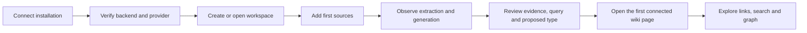

# Synapse 1.6.0 — full UI/UX, first-run and product review

Date: 2026-07-13
Scope: complete frontend, running desktop web application, first-run journey,
generation/review surfaces, supplied 12-page logo guide, and frontend architecture.

## Executive assessment

Synapse already has the right product concept: sources become linked pages, pages become a graph,
and generated knowledge remains inspectable. It should evolve as an **editorial knowledge
workspace**, not as a generic AI dashboard.

The main weakness is not missing feature count. It is that the application currently exposes its
implementation structure more clearly than the user's journey. Thirteen primary destinations,
technical provider language, competing ingestion entry points and inconsistent failure states make
a mature backend feel less reliable than it is. In Review, the proposal's origin, requested type,
effective created type, evidence and query quality are present but do not yet form one clear
decision trace.

The 1.6.0 correction therefore has two layers:

1. **Applied now:** shared connectivity state, recoverable Home/provider errors, a first-value Home,
   responsive Deep Research wiring, truthful provider mutations and one page-type visual registry.
2. **Product roadmap:** finish the guided journey through first generated page, simplify navigation,
   make Review an editable evidence-led decision surface, and decompose the largest frontend
   modules without changing the LLM Wiki model.

## Product experience target

The first session is successful only at **G**, not when infrastructure setup is dismissed or a
provider row exists.

## What was applied in this review

| Area         | Change                                                                                | User outcome                                                                              |
| ------------ | ------------------------------------------------------------------------------------- | ----------------------------------------------------------------------------------------- |
| Shell        | Existing status poll now owns a shared `checking / online / offline` state            | All screens describe the same backend condition without adding another poller             |
| Recovery     | Global offline banner opens the guided connection check                               | Failure is visible and actionable instead of appearing as unrelated 500 errors            |
| Home         | Failed overview requests render a retryable error before the loading skeleton         | The landing page can no longer remain indefinitely in a false loading state               |
| First use    | Zero-page Home explains `Sources → Connections → Wiki` and exposes the next actions   | A clean install starts with a task sequence instead of an operations dashboard            |
| Providers    | Loading, unavailable and unconfigured states are distinct; mutations rethrow failures | The selector cannot show a false success or mislabel an offline backend as “no providers” |
| Type visuals | One registry now drives Home, Preview, Review and Graph page-type identity            | Query, comparison and synthesis no longer change visual identity between these surfaces   |
| Theme        | Missing input and semantic tokens were defined for light/dark modes                   | Connection fields and error/success states no longer depend on unsafe browser fallbacks   |
| Responsive   | Deep Research component now uses its existing mobile layout hooks                     | The 360px detail pane stacks on narrow screens instead of forcing horizontal overflow     |
| Accessibility | `html[lang]` follows the detected or selected application language                   | Screen readers no longer receive a stale English document language in the Italian UI      |

These changes improve trust and orientation. They do not claim that every P1/P2 redesign below is
already implemented.

## Screen-by-screen review

Priority meanings: **P0** prevents trust or task completion; **P1** materially harms comprehension,
usability or consistency; **P2** is product polish or structural follow-up.

### Application shell and navigation

**Current state.** The rail makes the full feature inventory visible, which is useful to expert
users but produces thirteen competing destinations for a newcomer. On mobile the labels disappear,
leaving recognition dependent on icon memory. Operational state existed in the footer while
feature surfaces independently rendered loading/error states.

**Applied.** A single offline state and recovery banner now connects shell status with setup. The
existing poll remains the only network heartbeat.

**Next.** P1: group the rail by the mental model `Create / Understand / Maintain`; expose only
Home, Sources, Wiki, Search and Review as first-tier destinations during the empty-vault phase.
Keep Graph, Research, Lint, Convert and administrative tools reachable in a labelled secondary
group. Add URL/deep-link routing before public sharing so browser navigation, support links and
documentation can open a stable product location.

### Home

**Current state.** A populated Home is operationally rich, but its provider health, costs, active
jobs, type counts, domain sections and maintenance controls compete for attention. When the backend
was unavailable, the error was masked by the loading condition and the skeleton could persist.

**Applied.** Backend errors are recoverable. A zero-page workspace gets an editorial first-use
sequence with explicit source, connection and workspace actions.

**Next.** P1: after the first page, graduate Home from checklist to a concise “knowledge pulse”:
recent pages, pending decisions and active generation. Move reclassification, backfill and corpus
synthesis into Maintenance/Settings. Use one primary action per state.

### Chat

**Current state.** Chat is capable but the composer exposes too many decisions at once. Provider,
scope and retrieval controls make sense to advanced users but dilute the primary “ask the wiki”
action. The provider gate is useful but its relationship with installation readiness is not always
obvious.

**Next.** P1: keep one default grounded-chat mode and move model/retrieval overrides behind an
“Advanced” disclosure. Show which wiki/project supplies the answer and keep citations visually
adjacent to claims. Preserve the familiar LLM Wiki reading rhythm rather than styling Chat as a
separate product.

### Wiki and page reader

**Current state.** The three-panel reader is the strongest expression of the product concept.
However, several raw glyph controls, narrow metadata labels and panel-empty states feel like
developer tooling. Some navigation relies on custom events and local storage rather than a stable
route.

**Next.** P1: make the page title, type, source lineage and outbound/inbound links the primary
hierarchy. Move technical identifiers and coordinates under an optional diagnostics disclosure.
Replace raw glyph controls with the shared icon-button primitive and add stable page URLs.

### Sources

**Current state.** The desktop tree and preview are useful, but the fixed 280px structure has no
complete narrow-screen strategy. Sources, Import and Convert can appear to be three competing ways
to start.

**Next.** P0 for the first-user program: make **Sources** the canonical entry point. Present Upload,
Folder Import and Convert as source acquisition methods inside it. P1 responsive: tree first,
preview as a drawer, batch actions in an overflow menu, persistent ingest status and a direct
handoff from a completed run to its generated pages.

### Search

**Current state.** Search has the most coherent loading, error and empty-state language in the
product and is a good reference implementation. It combines filters and result context without
pretending that search is generation.

**Next.** P2: make saved/recent searches available, expose query scope clearly and reuse Search's
state treatment in Lint, Review and Research. Do not add dashboard decoration.

### Graph

**Current state.** The graph is technically strong: virtual canvas rendering, server-computed
layout, redundant legend encoding and useful filters. On narrow screens the filter toolbar, legend,
zoom, insights and detail affordances compete for limited space. Canvas colours intentionally need
concrete values, which had led to a second independent page-type map.

**Applied.** Canvas colours and CSS token identities now live in one page-type registry while
preserving Sigma's concrete-colour requirement.

**Next.** P1 responsive: keep Search and Filters visible; move legend and Insights into drawers;
ensure zoom/fit controls never overlap the rail or safe area. Use the graph as exploration after
the first wiki success, not as a first-run destination.

### Lint

**Current state.** Lint is valuable for maintainers but dense for general users. Rule terminology,
bulk actions and raw issue volume compete with the document-level outcome.

**Next.** P1: group by affected page and severity, lead with “what changes if I accept this,” and
reuse Review's decision card. Position Lint under Maintain, not alongside Sources/Wiki for a new
workspace.

### Review

**Current state.** Review exposes origin, item type, requested page type, created page type, query
quality, rationale and referenced pages. The information is fragmented across small chips and text,
so a discrepancy can look arbitrary even when the backend has a reason. Creation is still too close
to a one-click irreversible action for a market-facing product.

**Applied.** Page-type chips now use the same identity as Home, Wiki preview and Graph. Provider
mutation errors can no longer result in a success toast upstream.

**Next — P0/P1.** Turn each proposal into an editable decision trace:

1. evidence and source excerpts;
2. proposal origin and rule/model version;
3. generated search query with quality warning and edit action;
4. proposed type with explanation and editable override;
5. output preview/diff;
6. create, skip or dismiss with an auditable result;
7. persistent “Open created page” handoff after success.

This directly addresses perceived query/comparison/synthesis discrepancies: the UI must show
whether the difference comes from proposal origin, evidence, search query, type resolution or the
created output, rather than collapsing all of them into one badge.

### Deep Research

**Current state.** The run list/detail model is understandable on desktop. Its CSS already specified
a stacked mobile layout, but the component did not carry the selectors, leaving the detail panel at
360px on a narrow viewport.

**Applied.** The view and detail pane now bind to the mobile layout contract.

**Next.** P1: show budget, source acquisition and synthesis as a single observable timeline. Use a
bottom sheet/detail drawer on small screens once run-level actions increase.

### Import

**Current state.** Run status is informative, but a completed zero-page import and the location of
generated output are not always self-explanatory. It currently reads as a standalone tool.

**Next.** P0 first-use: a successful run must end in “Review N proposals” or “Open N pages.” A
zero-page completion must explain whether the cause was empty input, unsupported content,
configuration, filtering or generation failure. Fold this journey under Sources.

### Convert

**Current state.** Conversion exposes implementation/provider detail (including Marker) too early.
This is useful for operators but adds a second technical configuration surface for newcomers.

**Next.** P1: default to “Convert to source-ready Markdown,” show the selected engine only in
Advanced, and return the user to the source ingest flow with the converted artifact selected.

### Projects

**Current state.** Project creation and activation are visually similar but operationally distinct.
Creating a project does not make the runtime target obvious, and best-effort activation can leave a
gap between the UI selection and backend state.

**Next.** P0: make active project an explicit verified readiness condition; auto-activate a newly
created project unless the user chooses otherwise; show progress and failure inline. Rename vague
actions to “Create and use project” and “Switch project.”

### Settings

**Current state.** Desktop grouping is readable, but roughly twenty destinations compress into a
168px wrapped mobile area and lose group headings. Provider wording is implementation-centric.
Keyboard arrow navigation also needs to respect filtered/hidden items.

**Next.** P1: use category landing pages on narrow screens; keep search; describe providers in
vendor/task language first and protocol terms second. Separate everyday preferences from operator
maintenance. Verify filtered keyboard navigation before marketplace distribution.

### Setup, connection and token gate

**Current state.** Setup configures infrastructure but historically considered dismissal or a
provider record closer to completion than a verified first result. The duplicated connection
surface and undefined input token also created visual and trust inconsistencies.

**Applied.** Setup state is already versioned; connection can be reopened; provider probes are
truthful; the dark input token is defined; the shared banner reuses this guided flow.

**Next.** P0: extend setup through project, first sources and first page. The final screen should
summarise verified capabilities and give one action: “Open your first wiki page.”

## Design-system and frontend architecture review

### Findings

- The design language is coherent at token level, but implementation is fragmented: approximately
  1,658 inline style declarations and several competing button families make global changes risky.
- Missing semantic aliases (`error`, `success`, `danger`, secondary accent, mono font and input
  background) allowed individual screens to choose unrelated fallback colours.
- Home, Graph, Preview and Review encoded page types separately. This is now one shared registry.
- The largest components remain expensive to understand and change: GraphViewer (~3.5k lines),
  Home (~2.9k), Review (~2k), Sources (~1.5k), followed by Lint, Convert and Note.
- Home eagerly coordinates many requests. The shared connectivity fix removes false loading but a
  future slice should separate “knowledge summary,” “jobs” and “maintenance” data boundaries.
- Lazy-loaded primary sections, list virtualisation, reduced-motion support, local Geist assets,
  the API service worker policy and light/dark tokens are strong foundations worth preserving.

### Refactoring sequence

1. Create one shared `PageHeader`, `PageState`, `StatusChip`, `DecisionCard` and icon-button family.
2. Move repeated inline visual rules into component CSS; do not introduce another styling runtime.
3. Extract orchestration hooks from Home, Review, Sources and Graph before changing their layouts.
4. Replace custom-event/local-storage navigation with route contracts and typed action boundaries.
5. Add clean-install E2E coverage before further first-run work.
6. Add a screenshot/axe matrix at 320, 375, 768, 1024 and 1440 pixels in light and dark themes,
   covering empty, loading, error and success states.

## Brand and logo review

The supplied mark is strong. The connected-node “S” expresses documents becoming linked
knowledge, scales into an app icon, and does not need a redesign for 1.6.0.

Recommended usage:

- keep the current blue–indigo–violet mark and Geist wordmark;
- use the simplified three-node version below 24px;
- preserve the mark independently from the wordmark so a future name can reuse it;
- reserve gradients for connection, focus or progress moments—not decorative card backgrounds;
- use the full descriptor in public surfaces: **“The self-hosted LLM wiki that turns your sources
  into connected knowledge.”**

The name is the weaker asset. “Synapse” is crowded in AI and knowledge-management categories (see
the evidence-linked [product naming review](./PRODUCT-NAMING-REVIEW.md)), so
the release should use **Synapse LLM Wiki** as a transitional qualified name. Do not migrate storage
keys, bundle IDs, database names or package identifiers with a display-name experiment.

Preferred naming candidates for formal clearance:

| Candidate            | Positioning                                                | Mark compatibility    | Decision                     |
| -------------------- | ---------------------------------------------------------- | --------------------- | ---------------------------- |
| **Semaweave**        | semantic knowledge woven into a connected wiki             | Strong; retains the S | Preferred research candidate |
| **ScribeMesh**       | source documents connected into a navigable knowledge mesh | Strong; retains the S | Backup candidate             |
| **Synapse LLM Wiki** | explicit current category descriptor                       | Existing identity     | Transitional only            |

This is a product screening, not trademark clearance. Before renaming, check EUIPO/WIPO and target
markets, domains, GitHub, npm/PyPI/container registries, app stores and social handles, then obtain
legal review.

## Community and market readiness roadmap

### Release-blocking before a public beta

- clean-room E2E: install → connect → provider → project → upload → generate → review → open page;
- verified project/provider readiness and no false-success mutations;
- clear privacy/data-boundary copy for local, server and external-provider modes;
- one supported installation path with upgrade, backup and rollback documentation;
- signed artifacts and security contact/disclosure policy;
- stable deep links for support and documentation.

### Next product slice

- finish the first-value journey through first page;
- consolidate Sources/Import/Convert;
- implement editable Review preview and decision trace;
- simplify navigation by user phase;
- decompose large components behind tested interfaces;
- add release screenshot/accessibility/performance gates.

### Later differentiation

- reusable project templates and domain vocabularies;
- shareable, read-only wiki output independent of the operator UI;
- extension/plugin boundary with compatibility contracts;
- opt-in telemetry limited to product health, with self-hosted/off controls.

## Acceptance position

The applied 1.6.0 work removes the most damaging trust and visual-consistency failures found in the
runtime audit. The product is substantially clearer on an empty or disconnected installation.
It is not yet appropriate to claim a complete market-ready redesign: the remaining P0 journey work,
editable Review decision surface, navigation simplification and clean-install E2E gate should be
completed before a broad public launch.
