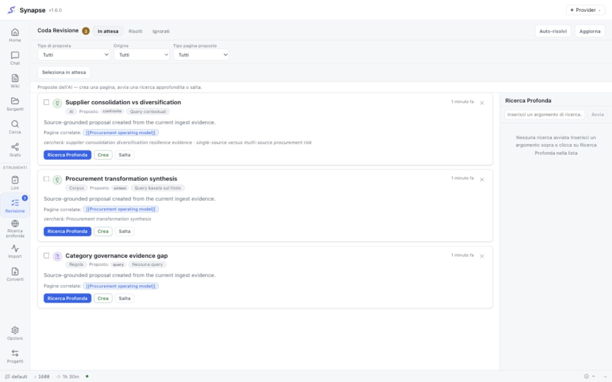
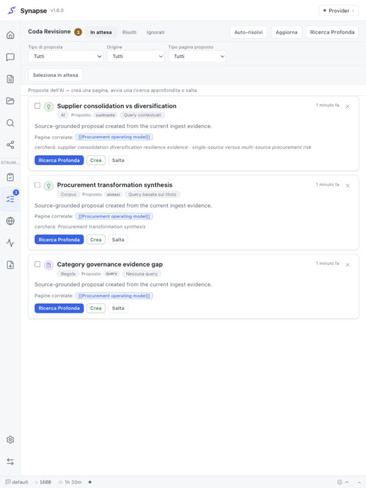
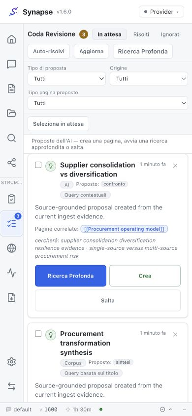
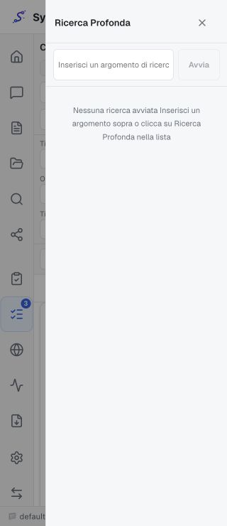
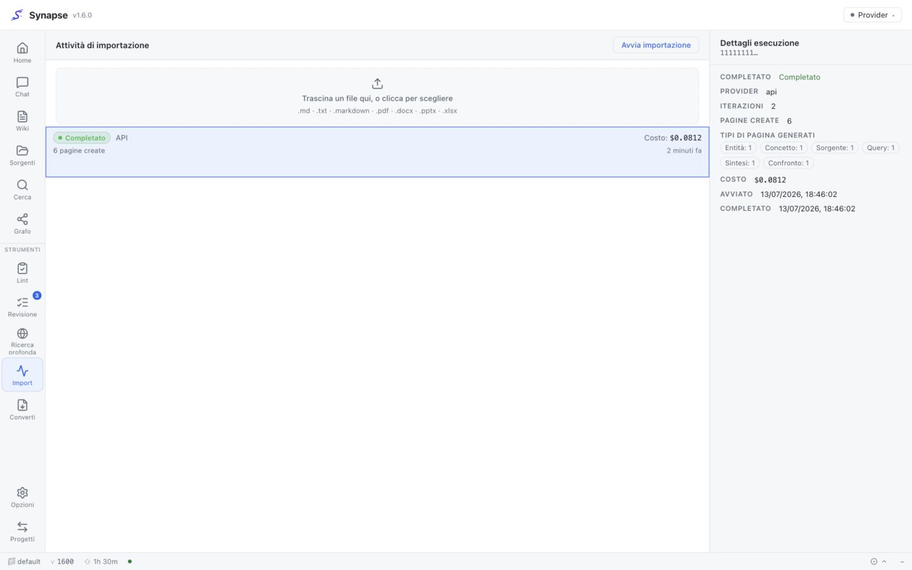

# Synapse v1.6.0 — Source-grounded generation lifecycle parity

v1.6.0 closes the structural causes behind the generative discrepancies observed between Synapse
and `nashsu/llm_wiki`. The objective is lifecycle parity—not identical prose or mechanical page
counts—with strong evidence gates, bounded costs and no automatic cleanup of existing vault data.

## What was discrepant

1. **Direct generation was artificially restricted.** Synapse's shared prompt allowed only
   entity, concept and source pages, while LLM Wiki could generate query, comparison and synthesis
   during ingest. Equal inputs could therefore never produce equal page-type distributions.
2. **Delegated and orchestrated Review saw different evidence.** The CLI route omitted the raw
   source and constructed a synthetic Analysis from titles; API/Local used typed Stage-1 analysis.
3. **Rule proposals starved detailed AI proposals.** Missing-link items were merged first under one
   small cap, crowding out higher-value comparisons, contradictions and research suggestions.
4. **Review hid decision provenance.** Clients could not tell rule from AI/corpus proposals or see
   whether Create ultimately wrote a different effective PageType.
5. **Corpus grouping was too permissive.** Untagged pages could share a synthetic bucket, allowing
   unrelated comparisons/syntheses across topics.
6. **Corpus runs were not idempotent.** Identity depended on provider-authored titles; rerunning—or
   forcing with a changed title—could create another file for the same member set.
7. **The UI obscured weak query proposals and run state.** Filters were incomplete, title-only
   searches looked like contextual queries, mobile Review was compressed and corpus polling did
   not reliably reach a terminal state.

## What changes

- All providers receive one six-type, source-grounded generation contract.
- Delegated Review receives bounded source/exact-run page evidence and omits unavailable Analysis.
- Rule/AI Review lanes use independent 8/12 caps under a 20-item ceiling; AI wins duplicates.
- Migration 0031 adds proposal origin, stable corpus generation identity and per-run PageType counts.
- Corpus clusters require a shared real domain, are capped independently by `max_candidates`, and
  can run in provider-free `review-only` mode.
- A stable SHA-256 key based on output kind and canonical member paths survives database rebuilds;
  the database unique index and deterministic file slug make normal and forced reruns idempotent.
- Review shows origin, proposed/effective type and query quality; filters are server-side; the
  Deep Research surface becomes a drawer at narrow viewports.
- Home offers **Generate now** and **Propose only**, polls only during active work and reports
  duplicates/untagged candidates.

## Upgrade

1. Back up Postgres and the vault using the normal deployment procedure.
2. Deploy backend and frontend v1.6.0 together.
3. Run `alembic upgrade head` (migration `0031`). The migration is additive.
4. Configure/backfill the domain vocabulary before expecting automatic corpus pages.
5. Optionally call `GET /ops/synthesize/audit?max_pages=500` and review the dry-run report.

Existing Review items are preserved with `proposal_origin=legacy`. Existing corpus pages remain
untouched and unkeyed. No migration or startup hook deletes, merges, renames or heuristically tags
legacy pages.

## Verification evidence

- Full backend suite: 2,707 passed, 4 skipped; focused lifecycle tests cover prompts, delegated
  evidence/cost accounting, proposal caps, schema/API, idempotency, domain guards, candidate
  bounds, single-flight and dry-run audit.
- Full frontend suite: 2,354 passed; ESLint, TypeScript and production build passed.
- Generated OpenAPI and ER schema include migration 0031 contracts.
- MkDocs strict build and `cargo check --locked` passed.
- Browser QA used a local 1.6.0 build with deterministic mock data; a fresh tab reported zero
  console warnings/errors. The installed 1.5.6 app and production vault were not mutated.

### Browser evidence

See [ADR-0073](../adr/ADR-0073-generation-and-review-lifecycle-parity.md) and
[ADR-0074](../adr/ADR-0074-idempotent-corpus-generation-and-operator-ux.md) for the decisions and
rejected alternatives.
